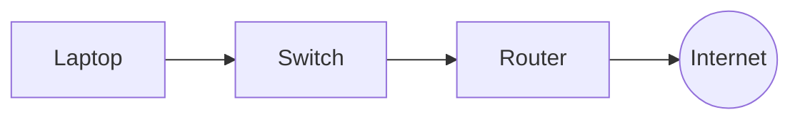
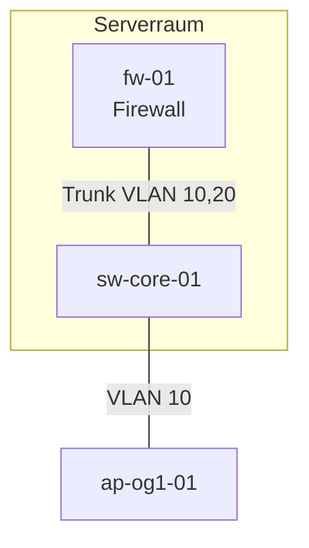
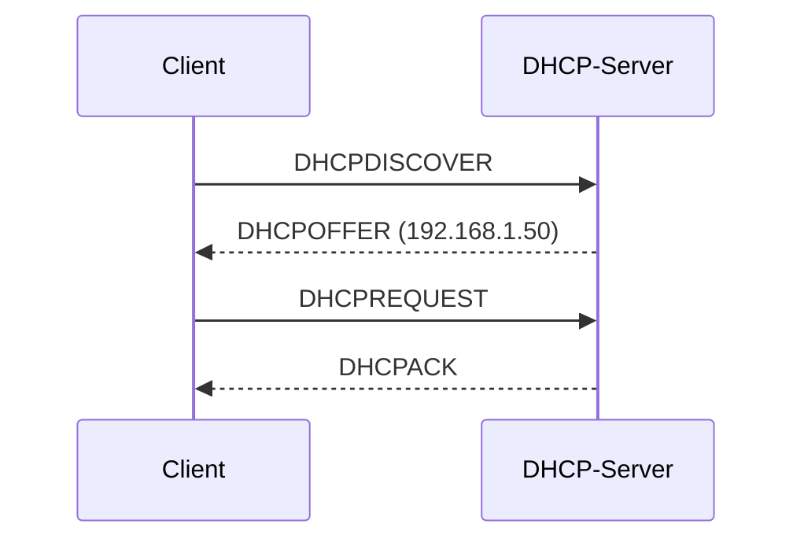
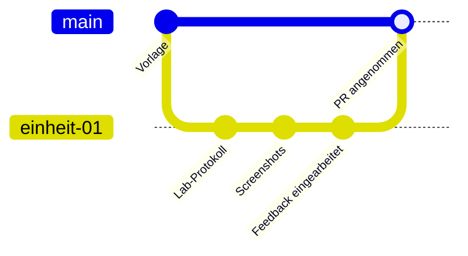

+++
title = "Markdown, Git und Pull-Request-Workflow"
weight = 10
+++

## Ziel

Diese Technik wird ab der ersten Hausaufgabe benötigt. Du lernst,

- Dokumentation in **Markdown** zu schreiben,
- sie mit **Git** zu versionieren,
- sie über einen **Pull Request (PR)** abzugeben und Feedback einzuarbeiten,
- Ordner und Screenshots so zu benennen, dass jede Abgabe auffindbar und lesbar ist.

## Grundlagen

### Warum Markdown?

Markdown ist reiner Text mit einfacher Auszeichnung. Es ist in jedem Editor les- und schreibbar, lässt sich mit Git sinnvoll vergleichen (Änderungen sind zeilenweise sichtbar) und wird von GitHub, GitLab und vielen Wikis direkt dargestellt. Ein Word-Dokument ist dagegen für Git eine Binärdatei: Man sieht nicht, *was* sich geändert hat.

| Zweck | Markdown | Ergebnis |
|---|---|---|
| Überschrift | `## Titel` | Überschrift Ebene 2 |
| Hervorhebung | `**fett**`, `*kursiv*` | **fett**, *kursiv* |
| Liste | `- Punkt` bzw. `1. Schritt` | Aufzählung bzw. Nummerierung |
| Code im Text | `` `docker ps` `` | `docker ps` |
| Codeblock | Dreifache Backticks mit Sprache (z. B. `bash`) | Formatierter Block |
| Link | `[Text](https://example.org)` | Link |
| Bild | `` | eingebettetes Bild |
| Tabelle | `\| A \| B \|` mit Trennzeile `\|---\|---\|` | Tabelle |
| Aufgabenliste | `- [ ] offen`, `- [x] erledigt` | Checkliste |
| Diagramm | Codeblock mit Sprache `mermaid` | gerendertes Diagramm, siehe [Diagramme mit Mermaid](#diagramme-mit-mermaid) |

Die vollständige Übersicht aller Markdown-Elemente findest du im [Markdown Cheat Sheet](https://www.markdownguide.org/cheat-sheet/) des Markdown Guide.

### Diagramme mit Mermaid

**Mermaid** beschreibt Diagramme als Text. Du schreibst einen Codeblock mit der Sprache `mermaid`, und die Darstellung entsteht beim Anzeigen. Das ist ideal für die Dokumentation: Das Diagramm liegt in derselben Datei wie der Text, Git zeigt Änderungen zeilenweise, und es gibt keine Bilddateien, die veralten oder verloren gehen.

**Wo wird es dargestellt?** In GitHub (Markdown-Dateien, Issues, Pull Requests), in diesem Skript und in der Vorschau von Visual Studio Code (mit der Erweiterung *Markdown Preview Mermaid Support*). Ein einfacher Texteditor zeigt nur den Quelltext.

#### Aufbau

Die erste Zeile legt den Diagrammtyp fest, danach folgen Knoten und Verbindungen:

````markdown

````

Ergebnis:


#### Die wichtigsten Diagrammtypen

| Typ | Beginn | Einsatz im Kurs |
|---|---|---|
| Flussdiagramm | `flowchart TB` (von oben nach unten) oder `flowchart LR` (links nach rechts) | Netzpläne, Architekturen, Entscheidungsbäume |
| Sequenzdiagramm | `sequenceDiagram` | Abläufe zwischen Systemen (z. B. Anmeldung, DHCP) |
| Git-Verlauf | `gitGraph` | Branches und Merges erklären |

#### Flussdiagramm: Formen und Verbindungen

| Schreibweise | Bedeutung |
|---|---|
| `A[Text]` | Rechteck |
| `A(Text)` | abgerundet |
| `A((Text))` | Kreis (z. B. Internet) |
| `A{Frage}` | Raute (Entscheidung) |
| `A --> B` | Pfeil |
| `A --- B` | Linie ohne Pfeil (z. B. Kabel) |
| `A -->\|ja\| B` oder `A ---\|Text\| B` | Beschriftete Verbindung |
| `subgraph Name ... end` | Gruppe (z. B. Serverraum, VLAN) |

Beispiel mit Gruppe und beschrifteten Kabeln:

````markdown

````


#### Sequenzdiagramm

````markdown

````


`->>` ist ein durchgezogener, `-->>` ein gestrichelter Pfeil (meist für Antworten).

#### Tipps

- **Bezeichner und Beschriftung trennen:** `fw["fw-01<br/>Firewall"]`. Vorne steht die kurze Kennung, in Klammern der angezeigte Text. Mit `<br/>` entsteht ein Zeilenumbruch.
- **Text mit Sonderzeichen in Anführungszeichen** setzen: Klammern, Doppelpunkte, Schrägstriche, `#` oder Wörter wie `end` brechen sonst die Syntax (`A["Netz 10.10.10.0/24 (VLAN 10)"]`).
- **Eine Aussage pro Diagramm.** Ab etwa 15 Knoten wird es unlesbar. Besser teilen (z. B. physisch und logisch getrennt).
- **Richtung wählen:** `TB` für Hierarchien (Internet oben), `LR` für Abläufe.
- **Einheitliche Namen** wie im IP-Plan und auf den Geräten verwenden.
- **Text neben das Diagramm schreiben:** ein Satz, was zu sehen ist, und eine Legende. Das hilft Lesenden mit Screenreader und bei Druck oder in Editoren ohne Mermaid-Unterstützung.
- **Ausprobieren:** Im [Mermaid Live Editor](https://mermaid.live) siehst du sofort, ob der Code funktioniert. Dort kannst du auch Bilder exportieren, falls einmal ein PNG nötig ist.

#### Typische Fehler bei Mermaid

| Fehler | Symptom | Lösung |
|---|---|---|
| Sonderzeichen oder Umlautklammern ohne Anführungszeichen | „Syntax error in text“ statt Diagramm | Text in `"..."` setzen |
| Der Knotenname `end` | Diagramm bricht ab | anderen Bezeichner verwenden oder `End` schreiben |
| Einrückungen oder `end` bei `subgraph` vergessen | Syntaxfehler | jeder `subgraph` braucht ein `end` |
| Codeblock ohne Sprache `mermaid` | Quelltext wird angezeigt | ```` ```mermaid ```` verwenden |
| Zu großes Diagramm | winzige Schrift, unleserlich | aufteilen |
| Nur Diagramm, kein Text | nicht barrierefrei, bei Fehlern wertlos | erklärenden Satz ergänzen |

Die vollständige Syntax steht in der [Mermaid-Dokumentation](https://mermaid.js.org/intro/).

### Git in drei Sätzen

Git speichert den Verlauf deiner Dateien als Folge von **Commits** (Schnappschüsse mit Beschreibung). Ein **Branch** ist eine parallele Arbeitslinie, auf der du Änderungen vorbereitest, ohne den Hauptzweig (`main`) zu verändern. Ein **Pull Request** ist die Bitte, einen Branch in `main` zu übernehmen, verbunden mit einer Diskussion und Review.



### Begriffe

| Begriff | Bedeutung |
|---|---|
| Repository (Repo) | Projektordner mit Verlauf |
| Clone | Kopie eines Repos auf deinem Rechner |
| Commit | gespeicherter Stand mit Nachricht |
| Branch | Arbeitslinie |
| Push | Commits zum Server (GitHub) schicken |
| Pull Request | Antrag auf Übernahme + Review |
| Merge | Zusammenführen von Branches |
| Remote (`origin`) | das Repo auf dem Server |

## Vorgehen Schritt für Schritt

Voraussetzung: Git ist installiert (`git --version`), ein GitHub-Konto besteht, und du hast Zugriff auf dein privates Portfolio-Repository. Die Befehle wurden in diesem Skript noch nicht in der Kursumgebung ausgeführt (*ungeprüft*).

### 1. Einmalige Einrichtung

```bash
git config --global user.name "Vorname Nachname"
git config --global user.email "name@example.org"
git config --global init.defaultBranch main
```

Die E-Mail-Adresse erscheint in jedem Commit. Verwende die bei GitHub hinterlegte Adresse oder die `noreply`-Adresse von GitHub.

### 2. Portfolio-Repository klonen

```bash
git clone https://github.com/<organisation>/<dein-portfolio>.git
cd <dein-portfolio>
```

Die genaue URL erhältst du über die Einladung zum Portfolio-Repository (_Link folgt in der ersten Einheit_).

### 3. Pro Aufgabe einen Branch anlegen

```bash
git switch main
git pull
git switch -c einheit-01
```

Branch-Namen: `einheit-<nn>` für die Dokumentationsaufgabe und `hausaufgabe-<nn>` für die Hausaufgabe. Kleinschreibung, keine Leerzeichen.

### 4. Dokumentation schreiben

Lege die Dateien im Ordner der Einheit an (siehe [Ordnerstruktur](#ordnerstruktur)) und schreibe in Markdown. Eine Live-Vorschau bietet z. B. Visual Studio Code (`Strg+Shift+V`).

### 5. Committen

```bash
git status                  # was hat sich geändert?
git add 01-virtualization-containerization/
git commit -m "Lab 1: Ubuntu-VM mit Snapshot dokumentiert"
```

**Gute Commit-Nachrichten** beschreiben, *was* und *warum*, in einer Zeile unter etwa 70 Zeichen, im Imperativ oder als kurzer Satz. Mehrere kleine Commits sind besser als ein riesiger am Ende.

| Schlecht | Gut |
|---|---|
| `Update` | `Lab 1: Netzwerkmodus der VM auf Bridged geändert` |
| `fix` | `Screenshot der Snapshot-Liste ergänzt` |
| `Abgabe final final 2` | `Hausaufgabe 1: Entscheidungsmatrix VM vs. Container` |

### 6. Pushen und Pull Request öffnen

```bash
git push -u origin einheit-01
```

Danach auf GitHub: **Compare & pull request**, Titel und Beschreibung nach der [Vorlage](#vorlage) ausfüllen, die Dozentin bzw. den Dozenten als *Reviewer* eintragen, **Create pull request**.

### 7. Feedback einarbeiten

Das Feedback steht als Kommentar im PR. Änderungen machst du **im selben Branch**:

```bash
# Änderungen vornehmen, dann
git add -A
git commit -m "Feedback eingearbeitet: Begründung zu Snapshots ergänzt"
git push
```

Der PR aktualisiert sich automatisch. Antworte auf jeden Kommentar kurz („erledigt“ oder Begründung, warum nicht) und markiere ihn als *resolved*. Gemerged wird nach der Freigabe durch die Lehrenden.

### 8. Nach dem Merge

```bash
git switch main
git pull
git branch -d einheit-01
```

## Ordnerstruktur

Jede Einheit hat einen eigenen Ordner mit dem Namen des Kapitels. Bilder liegen in einem `assets/`-Unterordner derselben Einheit.

```text
portfolio/
├── README.md                              # Übersicht, Name, Inhaltsverzeichnis
├── 01-virtualization-containerization/
│   ├── README.md                          # Dokumentationsaufgabe
│   ├── homework.md                        # Hausaufgabe
│   └── assets/
│       ├── 01-vm-einstellungen.png
│       └── 02-snapshot-liste.png
├── 02-networking-1/
│   └── ...
└── ...
```

Regeln:

- Dateinamen in **Kleinbuchstaben**, mit Bindestrichen, **ohne** Leerzeichen, Umlaute oder Sonderzeichen.
- Eine Einstiegsdatei `README.md` pro Ordner. GitHub zeigt sie automatisch an.
- Relative Links verwenden (`assets/bild.png`), keine absoluten Pfade vom eigenen Rechner.

## Screenshot-Konventionen

- **Dateiname:** `<laufende-nummer>-<inhalt>.png`, z. B. `03-docker-ps-ausgabe.png`.
- **Format:** PNG für Oberflächen, nicht größer als nötig (Breite höchstens etwa 1600 px). Keine Handyfotos von Bildschirmen.
- **Zuschneiden:** Nur der relevante Ausschnitt, aber so, dass der Kontext erkennbar ist (Fenstertitel, Befehl und Ausgabe).
- **Bildunterschrift und Alternativtext:** Jedes Bild bekommt einen Alternativtext (``) und im Text einen Satz, was zu sehen ist.
- **Vertraulichkeit:** Vor dem Speichern prüfen, ob **Passwörter, Tokens, öffentliche IP-Adressen, E-Mail-Adressen, echte Schüler- oder Lehrernamen** sichtbar sind. Schwärzen oder neu anfertigen. Das Repository ist privat, aber Daten gehören trotzdem nicht hinein, wenn sie nicht nötig sind.
- **Text bevorzugen:** Befehle und Ausgaben als Codeblock statt als Screenshot abgeben. Screenshots nur für grafische Oberflächen.

## Vorlage

### README der Dokumentationsaufgabe

````markdown
# Einheit <n>: <Titel>

- **Autor/in:** <Name>
- **Datum:** <TT.MM.JJJJ>
- **Umgebung:** <Host-Betriebssystem, Software mit Versionen>

## Ziel

<Ein bis zwei Sätze: Was wurde gemacht und warum?>

## Durchführung

1. <Schritt mit Befehl oder Einstellung>
2. ...

## Ergebnis

<Beschreibung, Screenshot oder Befehlsausgabe>

## Probleme und Lösungen

<Was ist schiefgelaufen, wie wurde es gelöst?>

## Reflexion (Schulkontext)

<Was bedeutet das für eine Schule? Datenschutz, Sicherheit, Aufwand.>

## Quellen

- <Link oder Verweis>
````

### Pull-Request-Beschreibung

````markdown
## Was enthält dieser PR?
Dokumentationsaufgabe Einheit 1 (Ubuntu-VM, Snapshots, Docker).

## Checkliste
- [ ] README.md im Ordner der Einheit vorhanden
- [ ] Alle Screenshots in `assets/`, ohne personenbezogene Daten oder Geheimnisse
- [ ] Befehle als Codeblöcke
- [ ] Reflexion zum Schulkontext enthalten
- [ ] Quellen angegeben

## Offene Fragen
<Optional>
````

## Beispiel

Ein kurzer Ausschnitt einer Abgabe, wie er auf GitHub gerendert würde:

````markdown
## Durchführung

1. VM in VirtualBox angelegt (Ubuntu Server 24.04 LTS, 2 vCPU, 2 GB RAM, 20 GB Disk).
2. Nach der Installation einen Snapshot `00-frisch-installiert` erstellt.
3. Docker installiert und getestet:

   ```bash
   docker run --rm hello-world
   ```

## Ergebnis

Die Ausgabe bestätigt, dass Docker korrekt arbeitet:


````

Der zugehörige Commit lautet z. B. `Lab 1: Docker installiert und mit hello-world getestet`.

## Häufige Fehler

| Fehler | Folge | Besser |
|---|---|---|
| Direkt auf `main` arbeiten | kein Review möglich | immer eigenen Branch und PR |
| Alles in einem Commit am Ende | Verlauf ohne Aussage | kleine, beschriebene Commits |
| Passwörter, Tokens oder `.env`-Dateien committet | Geheimnis ist im Verlauf, auch nach dem Löschen | vorher prüfen, `.gitignore` nutzen; ist es passiert: Geheimnis **sofort ändern** und die Lehrenden informieren |
| Große Binärdateien (VM-Images, ISOs) committet | Repository aufgebläht | nicht committen, nur beschreiben und verlinken |
| Screenshot statt Text | nicht kopierbar, nicht durchsuchbar | Codeblock |
| Bilder mit absolutem Pfad `C:\Users\...` | auf GitHub unsichtbar | relativer Pfad in `assets/` |
| Leerzeichen und Umlaute in Dateinamen | defekte Links | Kleinbuchstaben und Bindestriche |
| Feedback in neuem PR statt im selben Branch | Verlauf zerfällt | im selben Branch weiter committen |

## Einsatz in der Lehrveranstaltung

Hauptsächlich eingesetzt in: [Einheit 1]({})

Ab hier wird jede Abgabe nach diesem Workflow eingereicht. Die Rubrik bewertet u. a. die *Dokumentationsqualität* (siehe [Bewertungsrubrik]({})).

Weiterführend: [GitHub Docs: Hello World](https://docs.github.com/en/get-started/start-your-journey/hello-world), [GitHub Flavored Markdown Spec](https://github.github.com/gfm/), [Pro Git (Buch)](https://git-scm.com/book/de/v2).
