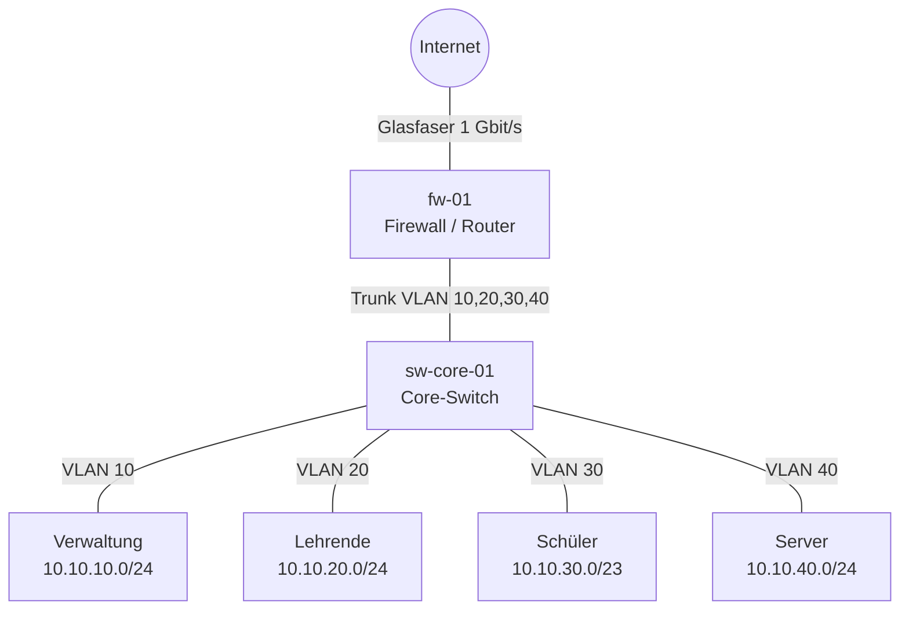

+++
title = "Netzwerkdiagramme und IP-Pläne"
weight = 20
+++

## Ziel

Du kannst ein Schulnetz so darstellen, dass Dritte es verstehen: als **Diagramm** (Topologie) und als **IP-Plan** (Adressen, Netze, Zuständigkeiten). Beide zusammen beantworten: *Was hängt woran, und wer hat welche Adresse?*

## Grundlagen

### Diagrammebenen

Ein einziges Diagramm für alles wird unlesbar. Unterscheide:

| Ebene | Zeigt | Zielgruppe |
|---|---|---|
| Physisch (Layer 1/2) | Räume, Schränke, Switches, Kabel, Access Points, Ports | Techniker, Elektriker |
| Logisch (Layer 3) | Subnetze, VLANs, Router, Firewall, Gateways | Administration |
| Dienste | Server, Dienste, Datenflüsse (z. B. Anmeldung, Internet, Cloud) | Administration, Datenschutz |

Pro Diagramm: **eine Ebene, eine Aussage**.

### Bestandteile eines guten Diagramms

- **Titel, Datum, Version, Autor** und eine **Legende** (Symbole, Linienarten, Farben).
- **Beschriftete Verbindungen** (Medium und Geschwindigkeit, z. B. „Cat6a, 1 Gbit/s“, „Trunk VLAN 10,20,30“).
- **Eindeutige Gerätenamen** nach festem Schema (z. B. `sw-edv-01`, `ap-og1-03`), die auch auf dem Gerät und im IP-Plan stehen.
- **Grenzen** sichtbar machen: Internet, Schulnetz, Gastnetz, Verwaltungsnetz.

### Diagramme als Text

Diagramme als Bilddatei aus einem Zeichenprogramm sind schwer zu versionieren. Mit **Mermaid** (Einführung: [Diagramme mit Mermaid]({}#diagramme-mit-mermaid)) schreibst du das Diagramm als Text in die Markdown-Datei. GitHub und dieses Skript stellen es direkt dar, und Git zeigt Änderungen zeilenweise. Für sehr große oder physische Pläne (Grundriss, Patchfeld) sind Zeichenprogramme wie diagrams.net sinnvoll. Speichere dann die **Quelldatei** (`.drawio`) zusätzlich zum Export (PNG/SVG).

### IP-Plan

Ein IP-Plan ist eine Tabelle aller Netze und der festen Adressen:

1. **Netzübersicht:** Netzname, VLAN-ID, Netzadresse mit Präfix, Gateway, DHCP-Bereich, Zweck.
2. **Adresstabelle:** Hostname, IP, MAC (optional), Standort, Zweck, Verantwortliche/r.
3. **Konventionen:** z. B. Gateway immer `.1`, Server `.10–.49`, Drucker `.50–.99`, DHCP `.100–.250`.

Für private Netze gelten die Bereiche aus RFC 1918 (`10.0.0.0/8`, `172.16.0.0/12`, `192.168.0.0/16`). Plane Reserven ein: Ein /24 mit 254 Adressen ist für eine Klasse großzügig, für ein WLAN mit Schüler-Geräten aber schnell zu klein.

## Vorgehen Schritt für Schritt

1. **Zweck und Ebene festlegen.** Wer liest das Diagramm, und was soll er danach wissen?
2. **Bestand erheben:** Geräte, Standorte, Verbindungen (Begehung, Switch-Konfiguration, Inventarliste).
3. **Namensschema und Adresskonvention festlegen** und im IP-Plan festhalten.
4. **Netze planen** (Subnetze, VLANs, Reserven) und in der Netzübersicht eintragen.
5. **Diagramm zeichnen:** Von außen nach innen (Internet → Firewall → Core → Access). Zuerst nur die wichtigen Verbindungen.
6. **Adresstabelle ausfüllen**, mit dem Diagramm abgleichen (stimmt jeder Name?).
7. **Prüfen:** Ein Kollege erklärt das Netz nur anhand der Unterlagen. Offene Fragen führen zu Ergänzungen.
8. **Versionieren und Datum aktualisieren**, bei jeder Änderung im Netz mitpflegen.

## Vorlage

### Kopf jedes Dokuments

```markdown
# Netzplan <Schule> – <Ebene>
- Version: 1.0
- Stand: <TT.MM.JJJJ>
- Autor/in: <Name>
- Gültig für: <Standort/Gebäude>
```

### Netzübersicht

```markdown
| Netz | VLAN | Adresse | Gateway | DHCP-Bereich | Zweck |
|---|---|---|---|---|---|
| Verwaltung | 10 | 10.10.10.0/24 | 10.10.10.1 | 10.10.10.100–250 | Direktion, Sekretariat |
| Lehrende | 20 | 10.10.20.0/24 | 10.10.20.1 | 10.10.20.100–250 | Lehrer-Geräte |
| Schüler | 30 | 10.10.30.0/23 | 10.10.30.1 | 10.10.30.50–31.250 | Schülergeräte |
| Server | 40 | 10.10.40.0/24 | 10.10.40.1 | – | interne Dienste |
```

### Adresstabelle

```markdown
| Hostname | IP | VLAN | Standort | Zweck | Verantwortlich |
|---|---|---|---|---|---|
| fw-01 | 10.10.40.1 | 40 | Serverraum | Firewall | <Name> |
| srv-nc-01 | 10.10.40.10 | 40 | Serverraum | Nextcloud | <Name> |
```

## Beispiel

Logische Ebene eines kleinen Schulnetzes (Mermaid):



Dazu gehört die Netzübersicht aus der Vorlage. Das Diagramm zeigt die Struktur, die Tabelle die Details: Beides referenziert dieselben Namen und VLAN-IDs.

## Häufige Fehler

| Fehler | Besser |
|---|---|
| Alles in einem überladenen Diagramm | je Ebene ein Diagramm |
| Keine Legende, keine Beschriftung der Verbindungen | Medium, Geschwindigkeit, VLANs ergänzen |
| Namen im Diagramm weichen von Gerätenamen ab | ein Namensschema, überall gleich |
| IP-Plan und Realität stimmen nicht überein | Plan bei jeder Änderung mitpflegen, Datum aktualisieren |
| Kein Platz für Wachstum | Reserven je Netz einplanen |
| Passwörter, WLAN-Schlüssel im Plan | nur Verweis auf den Passwortmanager |
| Nur Bild, keine Quelldatei | Mermaid-Text oder `.drawio` mit abgeben |

## Einsatz in der Lehrveranstaltung

Hauptsächlich eingesetzt in: [Einheit 2]({})
