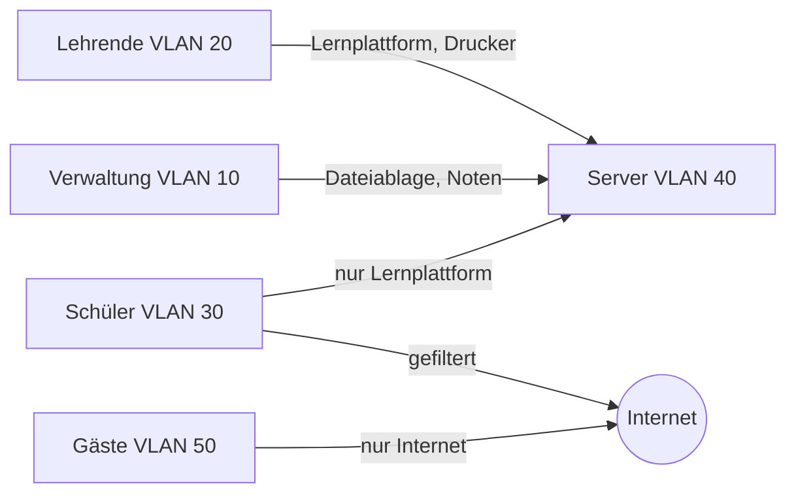

+++
title = "VLAN- und Berechtigungsmatrizen"
weight = 30
+++

## Ziel

Du kannst festhalten, **wer worauf zugreifen darf**, und zwar auf Netzebene (welches VLAN darf mit welchem kommunizieren) und auf Ebene der Benutzergruppen (wer darf welche Dienste und Daten nutzen). Eine Matrix macht Regeln überprüfbar, bevor sie in Firewall oder Verzeichnisdienst umgesetzt werden.

## Grundlagen

### Prinzipien

- **Need to know / Least Privilege:** Jede Gruppe erhält nur die Rechte, die sie für ihre Aufgabe braucht.
- **Default deny:** Was nicht ausdrücklich erlaubt ist, ist verboten. Die Matrix listet Erlaubnisse.
- **Rollen statt Personen:** Rechte werden Gruppen zugewiesen (z. B. *Lehrende*, *Schüler 1. Klassen*, *Verwaltung*, *Gäste*), nie Einzelpersonen.
- **Trennung nach Schutzbedarf:** Daten der Verwaltung (Noten, Schülerakten) brauchen strengeren Schutz als ein Gäste-WLAN.

### Zwei Matrizen

**1. Netzmatrix (VLAN × VLAN):** Zeilen = Quelle, Spalten = Ziel. Eintrag = erlaubt (✔), nicht erlaubt (✘) oder eingeschränkt (Hinweis auf Port/Dienst).

**2. Berechtigungsmatrix (Gruppe × Ressource):** Zeilen = Benutzergruppen, Spalten = Ressourcen (Dateiablage, Notenverwaltung, Drucker, Lernplattform …). Eintrag = Zugriffsstufe, z. B. `L` (lesen), `S` (schreiben), `V` (verwalten), `–` (kein Zugriff).

### Zusammenhang

Die Netzmatrix legt fest, welche Verbindungen technisch möglich sind (Firewall-Regeln zwischen VLANs), die Berechtigungsmatrix, was ein angemeldeter Benutzer innerhalb eines Dienstes darf (Gruppenrechte). Beide müssen zueinander passen: Wenn Schüler laut Netzmatrix den Notenserver gar nicht erreichen, ist ein Schreibrecht in der Berechtigungsmatrix gegenstandslos, aber auch irreführend.

## Vorgehen Schritt für Schritt

1. **Gruppen definieren:** Wer nutzt die IT der Schule? (Maximal 6–8 Gruppen halten.)
2. **Ressourcen und Schutzbedarf erfassen:** Welche Dienste und Daten gibt es? Wie sensibel (normal, hoch, sehr hoch)?
3. **Netze/VLANs zuordnen:** Welche Gruppe nutzt welches VLAN? Welche Server liegen in welchem VLAN?
4. **Netzmatrix ausfüllen**, ausgehend von *alles verboten*, nur nötige Verbindungen erlauben.
5. **Berechtigungsmatrix ausfüllen**, ebenfalls minimal beginnen.
6. **Begründen:** Zu jeder Erlaubnis in einer Spalte „Begründung“ den Zweck festhalten.
7. **Gegenprobe:** Typische Szenarien durchspielen („Eine Lehrerin druckt aus dem WLAN“, „Ein Gast will den Beamer nutzen“).
8. **Umsetzen und prüfen:** Regeln in der Firewall bzw. im Verzeichnisdienst anlegen und testen, anschließend Matrix mit Stand und Version versehen.

## Vorlage

### Netzmatrix

```markdown
| Quelle ↓ / Ziel → | Verwaltung (10) | Lehrende (20) | Schüler (30) | Server (40) | Gäste (50) | Internet |
|---|---|---|---|---|---|---|
| Verwaltung (10)   | ✔ | ✘ | ✘ | ✔ (Dateiablage, Noten) | ✘ | ✔ |
| Lehrende (20)     | ✘ | ✔ | ✘ | ✔ (Lernplattform, Drucker) | ✘ | ✔ |
| Schüler (30)      | ✘ | ✘ | ✔ | ✔ (nur Lernplattform) | ✘ | ✔ (gefiltert) |
| Gäste (50)        | ✘ | ✘ | ✘ | ✘ | ✔ | ✔ (gefiltert) |
```

### Berechtigungsmatrix

```markdown
| Gruppe | Dateiablage Lehrende | Notenverwaltung | Lernplattform | Drucker | Begründung |
|---|---|---|---|---|---|
| Lehrende | S | S (nur eigene Klassen) | V (eigene Kurse) | ✔ | Unterricht |
| Schüler | – | – | L, S (eigene Abgaben) | ✔ (Kontingent) | Unterricht |
| Verwaltung | L | V | – | ✔ | Administration |
| Gäste | – | – | – | – | kein Bedarf |
```

## Beispiel

Ausschnitt für ein Gymnasium mit drei Gruppen. Das Zielbild als Diagramm:



**Lesehilfe:** Der Pfeil bedeutet „darf initiieren“. Die Rückrichtung (Antworten) ist über Zustandsverfolgung (stateful) in der Firewall automatisch erlaubt. Zwischen Schülern und Verwaltung existiert bewusst keine Verbindung, weil in der Verwaltung Noten und Schülerakten liegen.

## Häufige Fehler

| Fehler | Besser |
|---|---|
| Rechte für Einzelpersonen | Rollen und Gruppen |
| „Alles erlaubt, Ausnahmen verbieten“ | Default deny, Erlaubnisse begründen |
| Matrix und tatsächliche Firewall-Regeln weichen ab | nach Umsetzung testen und abgleichen |
| Keine Begründung | Spalte „Begründung“ pflegen, sie hilft beim Review |
| Gäste im gleichen VLAN wie Schüler | Gäste eigenes, isoliertes VLAN |
| Zu feingliedrig (zwanzig Gruppen) | wenige, klare Rollen |
| Matrix nie aktualisiert | bei jeder Änderung Version und Datum ergänzen, siehe [Änderungsprotokolle]({}) |

## Einsatz in der Lehrveranstaltung

Hauptsächlich eingesetzt in: [Einheit 3]({})
