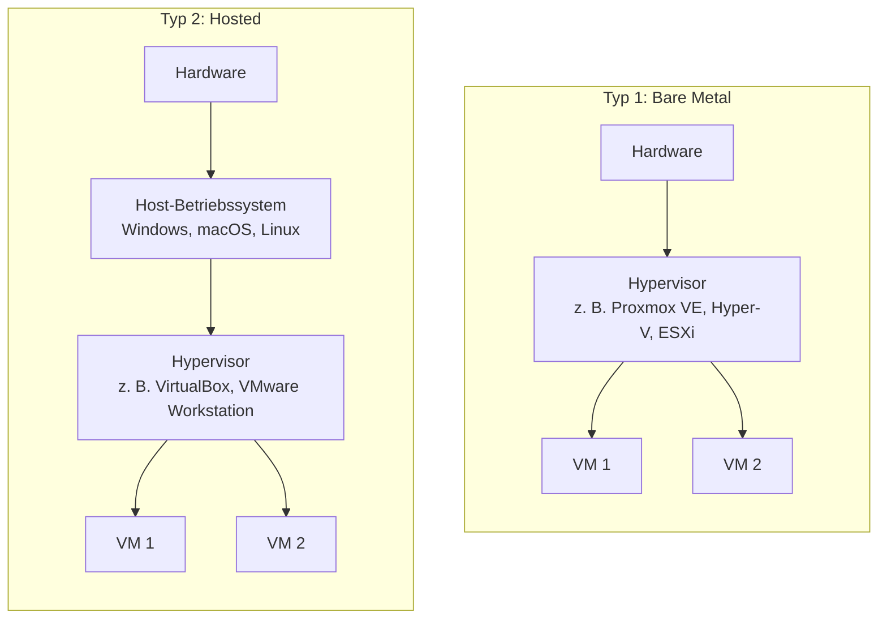
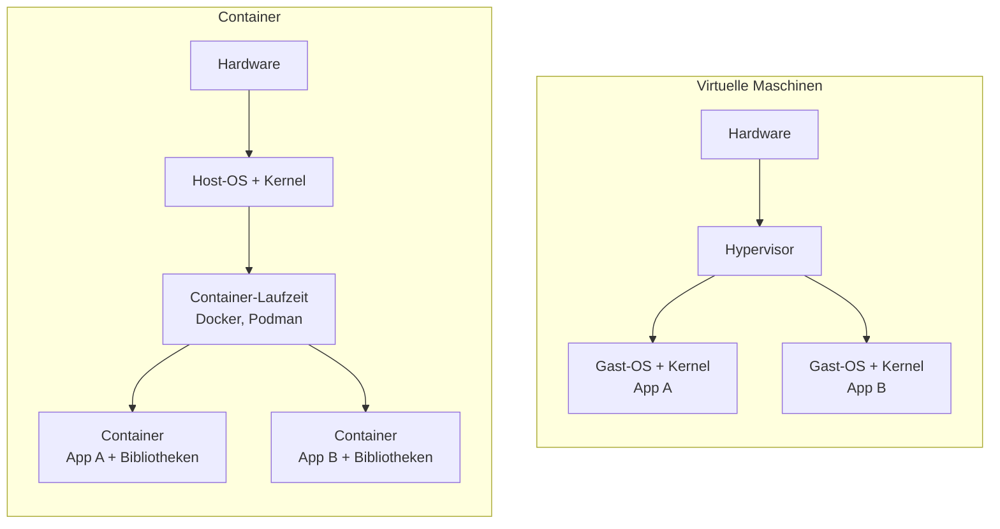
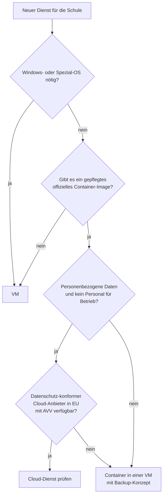

+++
title = "Theorie"
weight = 20
+++

## 1. Warum Virtualisierung in der Schule?

Ein typischer Schulserver ist die meiste Zeit **unterfordert** (wenige Prozent CPU-Auslastung), muss aber **zuverlässig** laufen und braucht Wartung. Virtualisierung löst mehrere Probleme gleichzeitig:

| Problem | Wirkung der Virtualisierung |
|---|---|
| Mehrere Dienste, wenig Hardware | mehrere VMs auf einem physischen Host |
| Dienste stören sich (Abhängigkeiten, Updates) | jede VM ist abgeschottet |
| Sicherung und Wiederherstellung | VM als Datei, Snapshots, Backup des gesamten Systems |
| Testen von Updates | Klon oder Snapshot, bei Fehler zurück |
| Hardwareausfall | VM auf anderem Host starten |
| Energie und Platz | weniger Geräte |
| Unterricht | jede/r Lernende hat eine eigene, sichere Übungsumgebung |

Für Schulen besonders relevant: **kleine Lehrenden-Teams**, **begrenzte Budgets**, **personenbezogene Daten** und **wechselnde Betreuung**. Einfache, gut dokumentierte Lösungen sind wichtiger als maximale Technik.

## 2. Grundbegriffe

- **Host:** der physische Rechner, auf dem virtualisiert wird.
- **Gast (Guest):** das Betriebssystem in der virtuellen Maschine.
- **Hypervisor (VMM):** Software, die virtuelle Hardware bereitstellt und die Ressourcen (CPU, RAM, Disk, Netzwerk) auf die Gäste verteilt.
- **Virtuelle Maschine (VM):** ein vollständiger virtueller Rechner mit eigenem Betriebssystem-Kern.
- **Image / Disk-Datei:** die virtuelle Festplatte als Datei (z. B. `.vdi`, `.vhdx`, `.qcow2`).
- **Snapshot:** gespeicherter Zustand einer VM, zu dem man zurückkehren kann.
- **Klon:** Kopie einer VM, vollständig oder verknüpft (*linked clone*).

## 3. Hypervisor-Typen

| | Typ 1 (Bare Metal) | Typ 2 (Hosted) |
|---|---|---|
| Läuft auf | direkt auf der Hardware | als Programm im Host-Betriebssystem |
| Leistung | sehr gut | etwas geringer |
| Einsatz | Server, Rechenzentrum, Schulserver | Laptop, Test, Unterricht |
| Beispiele | Proxmox VE, Microsoft Hyper-V (Server), VMware ESXi, KVM | VirtualBox, VMware Workstation/Fusion, Parallels, UTM |
| Verwaltung | oft Web-Oberfläche, Cluster | Desktop-Programm |

**Hinweis:** Hyper-V und KVM werden oft als Typ 1 eingeordnet, obwohl sie Teil eines Betriebssystems sind. Die Einteilung ist ein Denkmodell, die Grenzen sind fließend.

**Im Kurs:** Auf dem Laptop nutzen wir Typ 2 (VirtualBox). Später kann ein Server mit Proxmox oder Hyper-V gemeinsame Szenarien beherbergen.

### Hardwareunterstützung

Moderne CPUs haben Erweiterungen für Virtualisierung (Intel **VT-x**, AMD **AMD-V**, bei Apple Silicon in die Architektur integriert). Sie müssen im BIOS/UEFI aktiviert sein. Gäste laufen **am schnellsten, wenn Gast und Host dieselbe CPU-Architektur** haben (x86-64 auf x86-64, ARM auf ARM). Eine andere Architektur muss **emuliert** werden, das ist deutlich langsamer.

## 4. Virtuelle Maschinen im Detail

Jede VM enthält ein **vollständiges Betriebssystem mit eigenem Kernel**. Der Hypervisor stellt virtuelle Hardware bereit: CPU-Kerne, RAM, Festplatte, Netzwerkkarte.

### Netzwerkmodi (am Beispiel VirtualBox)

| Modus | Verhalten | Typischer Einsatz |
|---|---|---|
| **NAT** | VM erreicht das Internet über den Host, ist von außen nicht erreichbar | Standard, sicher, Updates laden |
| **NAT-Netzwerk** | mehrere VMs im selben privaten Netz, mit Internetzugang | Testnetz mit mehreren VMs |
| **Bridged** | VM erhält eine Adresse im Netz des Hosts, ist im LAN sichtbar | Server im echten Netz (WLAN-Bridging oft problematisch) |
| **Host-only** | nur Verbindung zwischen Host und VMs, kein Internet | isolierte Tests, Verwaltungszugang |
| **Internes Netz** | nur zwischen VMs, nicht zum Host | geschlossenes Szenario |

### Snapshots, Klone, Backups

- Ein **Snapshot** friert den Zustand ein (Disk, optional RAM). Er eignet sich als **kurzfristige Rückfallebene** vor Änderungen. Er ist **kein Backup**: Er liegt auf demselben Datenträger wie die VM, und lange Snapshot-Ketten verlangsamen und blähen die VM auf.
- Ein **Klon** ist eine eigenständige Kopie, nützlich für Vorlagen (*Golden Image*): einmal eine saubere Ubuntu-VM bauen, dann beliebig oft klonen. Achtung: Klone haben sonst gleiche Hostnamen und gleiche *Machine-ID* und müssen angepasst werden.
- Ein **Backup** ist eine Kopie **an einem anderen Ort**, die auch bei Verlust des Hosts verfügbar ist, und muss die **Wiederherstellung** nachweislich ermöglichen (Restore-Test).

## 5. Container im Detail

Ein Container ist ein **isolierter Prozess (oder eine Gruppe von Prozessen)**, der sich den **Kernel des Hosts teilt**. Linux stellt dafür zwei Mechanismen bereit:

- **Namespaces:** jeder Container sieht nur seine eigenen Prozesse, Netzwerkschnittstellen, Dateisysteme und Benutzer.
- **Control Groups (cgroups):** begrenzen und messen Ressourcen (CPU, RAM).

### Wichtige Begriffe (Docker)

| Begriff | Bedeutung |
|---|---|
| **Image** | unveränderliche Vorlage (Dateisystem-Schichten + Startbefehl) |
| **Container** | laufende (oder gestoppte) Instanz eines Images |
| **Registry** | Ablage für Images (z. B. Docker Hub, GitHub Container Registry) |
| **Dockerfile** | Bauanleitung für ein eigenes Image |
| **Volume** | Speicherort außerhalb des Containers für **persistente** Daten |
| **Port-Mapping** | Verknüpfung eines Host-Ports mit einem Container-Port (`-p 8080:80`) |
| **Docker Compose** | beschreibt mehrere Container, Netze und Volumes in einer Datei (`compose.yaml`) |

### Flüchtig by default

Das Dateisystem eines Containers ist **flüchtig**. Wird der Container gelöscht, sind die darin gespeicherten Daten weg. Alles, was bleiben muss (Datenbank, Uploads, Konfiguration), gehört in **Volumes** oder **Bind Mounts**. Das ist der häufigste Anfängerfehler.

### Docker-Alternativen

Docker ist weit verbreitet, aber nicht die einzige Laufzeit: **Podman** (daemonlos, ohne Root-Rechte möglich) und **containerd** sind verbreitet. Die Konzepte sind gleich, Images sind austauschbar (OCI-Standard).

## 6. Vergleich VM und Container

| Kriterium | Virtuelle Maschine | Container |
|---|---|---|
| Isolation | **stark** (eigener Kernel, Hardware-Abstraktion) | schwächer (gemeinsamer Kernel) |
| Größe | GB (komplettes Betriebssystem) | MB bis wenige 100 MB |
| Startzeit | Sekunden bis Minuten | Sekunden oder weniger |
| Ressourcenbedarf | höher (RAM pro Betriebssystem) | niedrig |
| Gast-Betriebssysteme | beliebig (Windows, Linux, BSD …) | Linux-Container brauchen Linux-Kernel (unter Windows/macOS über eine Hilfs-VM) |
| Portabilität | gut (Image-Dateien), aber groß | sehr gut (Image + Compose-Datei) |
| Updates | Betriebssystem **und** Anwendung | Image austauschen, Container neu erstellen |
| Zustand | meist langlebig (*Pets*) | meist austauschbar (*Cattle*) |
| Sicherung | ganze VM oder Anwendungsdaten | Volumes + Compose-Datei |
| Typischer Schuleinsatz | Windows Server, Domänencontroller, Legacy-Software | Lernplattform, Wiki, Webdienste, Test-Dienste |

**Faustregel:** Container, wenn die Anwendung als Image vorliegt und gut dokumentiert ist, VM, wenn ein eigenes Betriebssystem oder starke Isolation nötig ist. In der Praxis kombiniert man beides: *Container laufen in einer VM*, das bringt eine zusätzliche Isolationsschicht.

## 7. Entscheidungshilfe: VM, Container oder Cloud?

Ergänzende Fragen:

- **Wer betreibt und wartet das System?** (Vertretung, Know-how)
- **Wie kritisch ist der Dienst?** (Ausfall in der Schularbeit?)
- **Wie sieht die Wiederherstellung aus?** (Wie lange darf sie dauern, wie viel Datenverlust ist tragbar?)
- **Welche Daten werden verarbeitet?** (Schutzbedarf, siehe [Sicherheit und Datenschutz]({}))
- **Was kostet es?** (Lizenzen, Strom, Zeit)

Die Entscheidung wird als **ADR** festgehalten (siehe [Verarbeitungsverzeichnis und ADRs]({})).

## 8. Orchestrierung und Ausblick

Werden es viele Container, verwaltet man sie mit **Orchestrierung** (z. B. Kubernetes). An Schulen ist das meist **überdimensioniert**. Docker Compose auf einer VM reicht für die meisten Dienste. Auf Servern übernimmt der Hypervisor (Proxmox, Hyper-V) die Verwaltung von VMs, Hochverfügbarkeit (Migration einer VM auf einen anderen Host) gibt es mit mehreren Hosts im Cluster.

## Merksätze

- Eine **VM** virtualisiert **Hardware**, ein **Container** virtualisiert das **Betriebssystem** (Prozess-Isolation).
- **Snapshots sind kein Backup.**
- **Container-Dateisysteme sind flüchtig**, Daten gehören in Volumes.
- Wer **Isolation** braucht, nimmt eine VM. Wer **Schlankheit und Reproduzierbarkeit** braucht, nimmt Container.
- **Alles Wichtige dokumentieren:** Versionen, Ports, Volumes, Backup, Verantwortliche.
