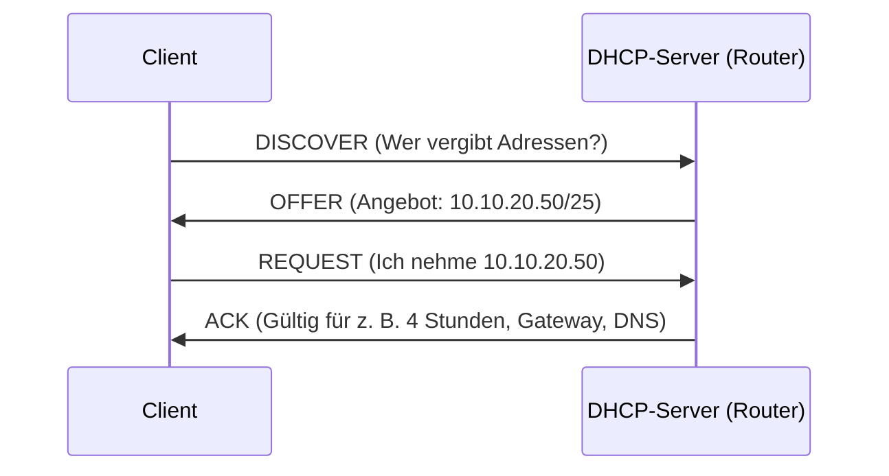
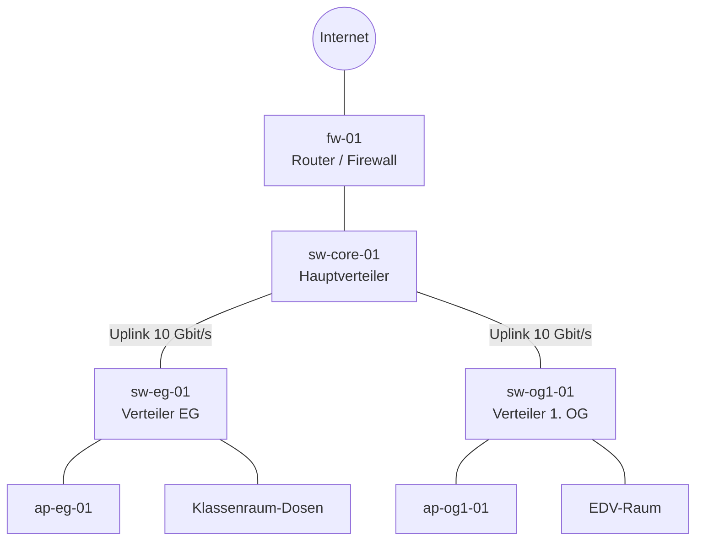

+++
title = "Theorie"
weight = 20
+++

## 1. Warum Netzplanung in der Schule?

Ein Schulnetz unterscheidet sich von einem Büronetz durch **Lastspitzen** (30 Geräte in einem Raum starten gleichzeitig eine Anwendung), **viele private Geräte** (BYOD), **unterschiedlich alte Gebäudeteile**, **wechselnde Betreuung** und **knappe Budgets**. Außerdem ist die Zuständigkeit oft geteilt: Der Schulerhalter ist für Gebäude und Anbindung zuständig, die Schule für Betrieb und Inhalte. Das sollte vor jeder Planung geklärt sein.

Gute Netzplanung beantwortet vier Fragen:

1. **Wer** (welche Gruppen, wie viele Geräte) braucht **was** (Dienste, Bandbreite, Internet)?
2. **Wo** (Räume, Etagen, Gebäude, Verteiler) wird gearbeitet?
3. **Wie** wird getrennt und geschützt (Teilnetze, Zugriff, Gastzugang)?
4. **Wer betreut** das Netz, und woran erkennt man Fehler?

## 2. Schichtenmodell: Störungen systematisch eingrenzen

Netzwerke sind in **Schichten** aufgebaut. Jede Schicht nutzt die darunterliegende. Wir verwenden das **TCP/IP-Modell** mit vier Schichten (das OSI-Modell mit sieben Schichten unterteilt feiner und taucht in Prüfungen und Datenblättern auf).

| TCP/IP-Schicht | (OSI) | Aufgabe | Beispiele | Frage bei Störungen |
|---|---|---|---|---|
| Anwendung | 5–7 | Dienste für Programme | HTTP(S), DNS, DHCP, SSH | Antwortet der Dienst? |
| Transport | 4 | Verbindung zwischen Programmen, Ports | TCP, UDP | Ist der Port erreichbar? |
| Internet | 3 | Adressierung und Weiterleitung zwischen Netzen | IP, ICMP (`ping`), Router | Ist das Gateway erreichbar? |
| Netzzugang | 1–2 | Übertragung im lokalen Netz | Ethernet, WLAN, Switch, MAC-Adresse | Ist das Kabel gesteckt, der Link aktiv? |

**Praxisregel: von unten nach oben prüfen.** Erst Kabel und Link-LED, dann IP-Adresse, dann Gateway, dann DNS, dann der Dienst. Das spart Zeit, weil ein Fehler in einer unteren Schicht alle darüberliegenden stört. Genau diese Reihenfolge übst du im Lab.

## 3. Ethernet, Switch und ARP

- **MAC-Adresse:** 48 Bit, fest in der Netzwerkkarte, nur im **lokalen Netz** relevant (z. B. `08:00:27:ab:cd:ef`).
- **Switch:** Verbindet Geräte im selben Netz. Er lernt, an welchem Port welche MAC-Adresse hängt (**MAC-Tabelle**), und leitet Rahmen gezielt weiter.
- **Broadcast-Domäne:** Alle Geräte, die einen Broadcast (Rundruf an alle) erreicht. Ein Switch trennt sie nicht, ein **Router** schon. Zu große Broadcast-Domänen belasten das Netz, ein Grund für Teilnetze und VLANs (Einheit 3).
- **ARP:** Um an eine IP-Adresse im lokalen Netz zu senden, fragt ein Gerät per Broadcast: „Wer hat 10.10.20.1?“ Die Antwort (MAC-Adresse) wird in der **ARP-Tabelle** gemerkt (`ip neigh`).
- **Managed vs. unmanaged Switch:** Unmanaged Switches funktionieren ohne Konfiguration, können aber weder VLANs noch Überwachung. Für die Schule sind **managed Switches** empfehlenswert, mindestens für Verteiler und Uplinks.
- **Schleifen:** Verbindet jemand zwei Dosen eines Raums mit einem Patchkabel, entsteht eine Schleife und das Netz bricht durch Broadcast-Stürme zusammen. Managed Switches schützen sich mit **(Rapid) Spanning Tree** (STP/RSTP). Aktiviere es und dokumentiere es.

## 4. IPv4-Adressierung und Subnetting

### Adresse, Netzmaske, Präfix

Eine IPv4-Adresse hat 32 Bit, geschrieben als vier Zahlen (`10.10.20.37`). Die **Netzmaske** legt fest, welcher Teil das **Netz** und welcher Teil das **Gerät** bezeichnet. Kurzschreibweise: **Präfixlänge** (CIDR), z. B. `/25` = die ersten 25 Bit sind Netzanteil.

| Präfix | Netzmaske | Adressen gesamt | nutzbare Geräte-Adressen |
|---|---|---|---|
| /22 | 255.255.252.0 | 1024 | 1022 |
| /23 | 255.255.254.0 | 512 | 510 |
| /24 | 255.255.255.0 | 256 | 254 |
| /25 | 255.255.255.128 | 128 | 126 |
| /26 | 255.255.255.192 | 64 | 62 |
| /27 | 255.255.255.224 | 32 | 30 |
| /28 | 255.255.255.240 | 16 | 14 |
| /29 | 255.255.255.248 | 8 | 6 |
| /30 | 255.255.255.252 | 4 | 2 |

Von den Adressen eines Netzes sind **zwei reserviert**: die erste (**Netzadresse**) und die letzte (**Broadcast-Adresse**). Daher: nutzbar = 2^(32 − Präfix) − 2.

**Beispiel:** `10.10.20.0/25`: Netzadresse `10.10.20.0`, Broadcast `10.10.20.127`, nutzbare Adressen `10.10.20.1` bis `10.10.20.126` (126 Geräte). Das nächste /25 beginnt bei `10.10.20.128`.

### Zwei Geräte im selben Netz?

Ein Gerät vergleicht seine Adresse und die Zieladresse mit der eigenen Netzmaske. Liegt das Ziel im **selben Netz**, sendet es direkt (per ARP und Switch). Liegt es **woanders**, sendet es das Paket an das **Standard-Gateway** (den Router), der weiterleitet.

### Private und besondere Bereiche

| Bereich | Bedeutung |
|---|---|
| `10.0.0.0/8`, `172.16.0.0/12`, `192.168.0.0/16` | **Private Adressen** (RFC 1918), im Internet nicht geroutet. Für Schulnetze üblich. |
| `169.254.0.0/16` | **Link-Local** (RFC 3927): Das Gerät hat keine Adresse per DHCP bekommen und vergibt sich selbst eine. **Warnzeichen** für einen nicht erreichbaren DHCP-Server. |
| `100.64.0.0/10` | Gemeinsamer Adressraum für Provider-NAT (CGNAT). Taucht in Router-Oberflächen auf, wenn der Provider kein eigenes öffentliches IPv4 vergibt. |
| `127.0.0.0/8` | Loopback (`localhost`), das Gerät selbst. |

### Subnetting planen

1. **Geräte zählen** (pro Gruppe, auch mehrere Geräte je Person).
2. **Reserve** aufschlagen. Faustregel: **30 bis 50 %** für Wachstum.
3. **Kleinsten Präfix wählen**, dessen nutzbare Adressen reichen.
4. **Netze in einem Gesamtbereich** anordnen (z. B. `10.10.0.0/16`), mit Lücken für Erweiterungen, und eine **Konvention** festlegen (z. B. dritter Oktett = VLAN-ID).
5. Im **IP-Plan dokumentieren** (siehe [Netzwerkdiagramme und IP-Pläne]({})).

Zu große Netze (ein /16 für alles) sind ebenso ein Fehler wie zu kleine: Das eine bremst durch Broadcasts und verhindert Trennung, das andere zwingt zum Umbau.

## 5. Kerndienste: Gateway, DHCP, DNS, NAT

- **Standard-Gateway:** Der Router eines Netzes, Adresse oft `.1`. Ohne Gateway funktioniert nur das lokale Netz.
- **DHCP** vergibt Adresse, Netzmaske, Gateway und DNS-Server automatisch (Ablauf siehe Diagramm). Wichtig sind **Adressbereiche** (Pools), **Ausnahmen** für feste Adressen und die **Lease-Zeit** (Gültigkeit). Faustregel: im Schüler-WLAN kurze Leases (ca. 1–4 Stunden), weil viele Geräte kommen und gehen, im Kabelnetz lange.
- **Feste Adressen** brauchen Server, Drucker und Netzwerkgeräte. Entweder außerhalb des DHCP-Pools festlegen oder per **DHCP-Reservierung** (MAC → feste IP).
- **DNS** übersetzt Namen in Adressen (`ubuntu.com` → IP). Fällt DNS aus, wirkt „das Internet“ kaputt, obwohl `ping 1.1.1.1` funktioniert. Das ist die wichtigste Unterscheidung bei Störungen.
- **NAT** (genauer PAT): Der Router setzt viele private Adressen auf eine öffentliche um. Das ist **keine Firewall**, auch wenn es ähnlich wirkt. Von außen erreichbare Dienste (Portweiterleitung) vergrößern die Angriffsfläche und sollten die Ausnahme sein.

## 6. IPv6 in Kürze

IPv6 hat 128-Bit-Adressen (`2001:db8::1`, Beispielbereich). Typisch ist **ein /64 je Teilnetz**, Adressvergabe per SLAAC oder DHCPv6. Viele Betriebssysteme und Dienste nutzen IPv6 automatisch, sobald es im Netz angeboten wird. Für die Schule gilt: IPv4 bleibt auf absehbare Zeit zentral, aber **IPv6 nicht blind abschalten**, sondern bewusst entscheiden und dokumentieren. Firewall-Regeln müssen dann für **beide** Protokolle gelten.

## 7. Kabelgebundene Netze planen

### Strukturierte Verkabelung

Statt jedes Gerät einzeln zu verkabeln, baut man ein **dauerhaftes Verkabelungssystem** nach Norm (ISO/IEC 11801, EN 50173) in drei Bereichen:

| Bereich | Verbindet | Typisches Medium |
|---|---|---|
| **Primär** (Gelände) | Gebäude untereinander | Glasfaser (Singlemode, OS2) |
| **Sekundär** (Steigzone) | Gebäudeverteiler mit Etagenverteilern | Glasfaser (Multimode OM3/OM4) oder Singlemode |
| **Tertiär** (Etage) | Etagenverteiler mit Anschlussdosen | Kupfer, Cat6A |

### Medien im Überblick

| Medium | Typische Geschwindigkeit | Reichweite | Einsatz |
|---|---|---|---|
| Kupfer Cat5e | 1 Gbit/s | 100 m | Altbestand, noch ausreichend für Arbeitsplätze |
| Kupfer Cat6 | 1 Gbit/s, 10 Gbit/s auf kurzen Strecken | 100 m (10 Gbit/s nur kurz) | Neuinstallation, knapp |
| Kupfer Cat6A | 10 Gbit/s | 100 m | **Empfehlung für Neuinstallation**, WLAN-Anbindung |
| Glasfaser Multimode (OM3/OM4) | 10 Gbit/s und mehr | einige hundert Meter | Steigleitungen im Gebäude |
| Glasfaser Singlemode (OS2) | 10 Gbit/s und mehr | Kilometer | Gebäudeverbindung, Zukunftssicherheit |

**Wichtige Grenze:** Bei Kupfer sind **100 m** der Gesamtstrecke (Kanal) zulässig, davon höchstens **90 m fest verlegt** und je 5 m Patchkabel an den Enden. Längere Strecken brauchen Glasfaser oder einen weiteren Verteiler.

### Power over Ethernet (PoE)

PoE versorgt Geräte (Access Points, Telefone, Kameras) über das Netzwerkkabel. Du brauchst keine Steckdose an der Decke.

| Standard | Typische Bezeichnung | Leistung am Switch-Port (Faustregel) |
|---|---|---|
| IEEE 802.3af | PoE | ca. 15 W |
| IEEE 802.3at | PoE+ | ca. 30 W |
| IEEE 802.3bt | PoE++ | ca. 60 W oder 90 W |

Aktuelle WLAN-Access-Points benötigen häufig PoE+ (Datenblatt prüfen). Wichtig ist das **Leistungsbudget** des Switches: 24 Ports mit je 15 W ergeben 360 W, das Gesamtbudget des Geräts ist oft kleiner als die Summe aller Ports.

### Topologie und Aufbau

Schulnetze werden **hierarchisch** in Sternform aufgebaut: Endgeräte und Access Points hängen an **Access-Switches** (Etagenverteiler), diese mit **Uplinks** an einen **Core-Switch** (Hauptverteiler), dieser am **Router/der Firewall**. In kleinen Schulen sind Core und Router oft ein Gerät oder zwei.

### Planungshinweise

- **Ein Verteiler je Etage**, Wege zu den Dosen höchstens 90 m. Verteilerräume abschließbar, belüftet und mit **USV** (unterbrechungsfreie Stromversorgung) für Core-Komponenten.
- **Reserveports** (ca. 30 %) und Reservefasern einplanen.
- **Mehrere Dosen je Klassenraum** (Lehrerplatz, Beamer, AP, Reserve). Nachträgliche Verkabelung ist teurer als eine großzügige Erstplanung.
- **Redundanz:** Zweiter Uplink zwischen Etagenverteiler und Core erhöht die Ausfallsicherheit (benötigt STP/RSTP oder Link-Aggregation).
- **Beschriften:** Jede Dose, jedes Patchfeld und jedes Kabel erhält ein eindeutiges Label, das sich im Plan wiederfindet. Ohne Labels ist jede Störung ein Suchspiel.

## 8. WLAN planen

### Standards und Frequenzbänder

| Name | IEEE | Band | Hinweis |
|---|---|---|---|
| Wi-Fi 4 | 802.11n | 2,4 und 5 GHz | Altgeräte |
| Wi-Fi 5 | 802.11ac | 5 GHz | weit verbreitet |
| Wi-Fi 6 / 6E | 802.11ax | 2,4 und 5 GHz (6E zusätzlich 6 GHz) | effizienter bei vielen Geräten |
| Wi-Fi 7 | 802.11be | 2,4, 5 und 6 GHz | neu, nicht alle Geräte unterstützen es |

- **2,4 GHz:** große Reichweite, aber nur **drei praktisch überlappungsfreie Kanäle** (1, 6, 11) und viele Störquellen (Bluetooth, Mikrowellen, Nachbarnetze).
- **5 GHz:** viel mehr Kanäle, höhere Datenraten, geringere Reichweite. Ein Teil der Kanäle verlangt **DFS** (Radarerkennung), wodurch der Access Point den Kanal kurzfristig wechseln kann.
- **6 GHz:** nur Wi-Fi 6E/7, kaum Altlasten, kurze Reichweite. In der EU ist ein Teil des 6-GHz-Bands für WLAN freigegeben.

### Kapazität statt nur Abdeckung

Ein WLAN-Kanal ist ein **geteiltes Medium**: Alle Geräte in Reichweite teilen sich die Sendezeit (Airtime). Langsame oder weit entfernte Geräte verbrauchen viel Sendezeit und bremsen alle. In Schulen ist daher nicht die Reichweite das Problem, sondern die **Dichte**.

**Faustregeln für die Planung (Herstellerangaben prüfen):**

- **Ein Access Point je Klassenraum** (niedrige Sendeleistung, Wände dämpfen bewusst), statt wenige starke Geräte am Gang. So wird jeder Kanal wiederverwendet.
- Planungswert ca. **25 bis 30 gleichzeitig aktive Geräte je AP**. Eine Klasse mit 28 Tablets reizt das aus.
- **Kanalbreite 20 MHz** (bei hoher Dichte), 5 GHz bevorzugen, 2,4 GHz nur für Altgeräte oder abschalten.
- Sendeleistung **reduzieren** (nicht auf Maximum), damit Nachbarräume nicht denselben Kanal stören.
- **Nachbar-APs auf unterschiedliche Kanäle** legen, automatische Kanalwahl des Systems nutzen.
- Bei **Unterrichts-Spitzen** (alle starten gleichzeitig ein Update) bremst auch die **Internetanbindung**. Plane die Gesamtbandbreite mit.

### Verwaltung der Access Points

| Variante | Beschreibung | Vor- und Nachteile |
|---|---|---|
| **Standalone** | Jeder AP einzeln konfiguriert | einfach bei 1–3 APs, aufwendig und fehleranfällig bei vielen |
| **Controller** (lokal) | zentrale Verwaltung im eigenen Netz | volle Kontrolle, Betreuungsaufwand |
| **Cloud-gemanagt** | Verwaltung über Anbieter-Portal | wenig Aufwand, Daten und Abhängigkeit beim Anbieter (Datenschutz prüfen) |

Mehrere APs brauchen **einheitliche Konfiguration** (SSID, Sicherheit) und **Roaming** (Standards 802.11k/v/r), damit Geräte beim Raumwechsel nahtlos wechseln.

### Sicherheit im WLAN

| Verfahren | Beschreibung | Bewertung für die Schule |
|---|---|---|
| WEP, WPA (TKIP) | veraltet | **nicht verwenden** |
| WPA2-Personal / WPA3-Personal | ein gemeinsames Passwort (PSK bzw. SAE) | einfach, aber **jeder kennt das Passwort**. Bei Personalwechsel oder Weitergabe muss es geändert werden. Für Gastnetz oder einfache Geräte tauglich. |
| WPA2-Enterprise / WPA3-Enterprise (802.1X) | Anmeldung mit **eigenem Benutzerkonto**, geprüft durch einen RADIUS-Server | **Empfehlung** für Lehrenden- und Schülernetz: Zugriff pro Person, sperr- und nachvollziehbar. Setzt Benutzerverwaltung voraus (Einheit 4). |

Weitere Hinweise:

- **Getrennte SSIDs** je Zweck (Lehrende, Schüler, Gäste, Geräte), jede in einem **eigenen Netz**. Mehr als etwa 3–4 SSIDs je AP belasten die Sendezeit durch Verwaltungs-Pakete.
- **Verstecken der SSID und MAC-Filter** sind **keine Sicherheit**: Die SSID ist trotzdem auslesbar, und moderne Geräte verwenden zufällige MAC-Adressen.
- Verwaltungsoberflächen der Access Points mit starkem Passwort, Standardpasswörter ändern, Firmware aktuell halten.

### Planung und Messung (Site Survey)

- **Vorab (predictive):** Grundriss in einem Planungswerkzeug, Wandmaterial und Gerätedichte eingeben, Standorte der APs berechnen.
- **Vor Ort (Messung):** Mit Messgerät oder Laptop Signalstärke und Störungen messen. Für den Einstieg reichen Bordmittel (z. B. `nmcli dev wifi` unter Linux oder Hersteller-Apps).
- **Nach dem Betrieb:** Messen, ob die Planung stimmt (Beschwerden, Auslastung der Kanäle).

## 9. Vorgehen bei der Netzplanung (Zusammenfassung)

1. **Anforderungen** erheben: Gruppen, Geräte, Dienste, Bandbreite, Unterrichtsszenarien.
2. **Bestand** aufnehmen: Gebäude, Verteiler, Kabel, Geräte, Anbindung.
3. **Netze und Adressen** planen (Subnetting, Reserven, Konvention).
4. **Verkabelung** planen (Medien, Verteiler, PoE, Uplinks, Redundanz).
5. **WLAN** planen (Kapazität, Kanäle, Sicherheit, Verwaltung).
6. **Dokumentieren** (Diagramme, IP-Plan, Beschriftung).
7. **Betrieb** festlegen: Zuständigkeit, Überwachung, Updates, Änderungsprozess.
