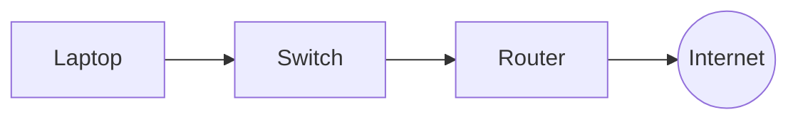
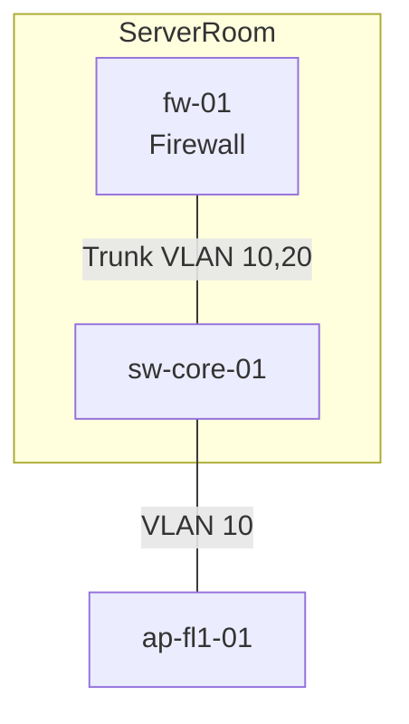
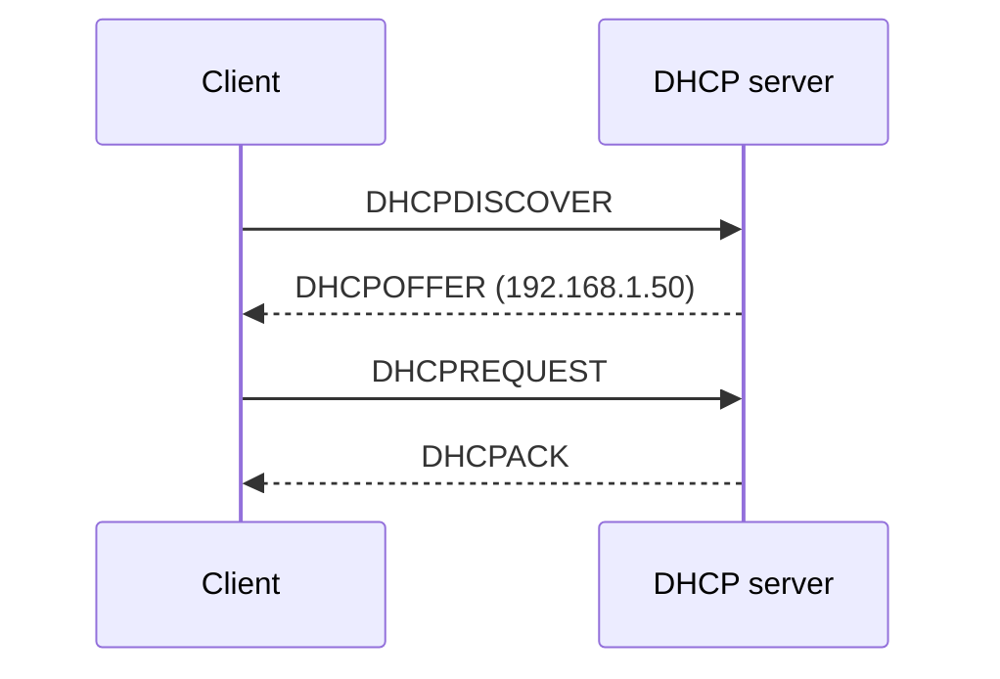
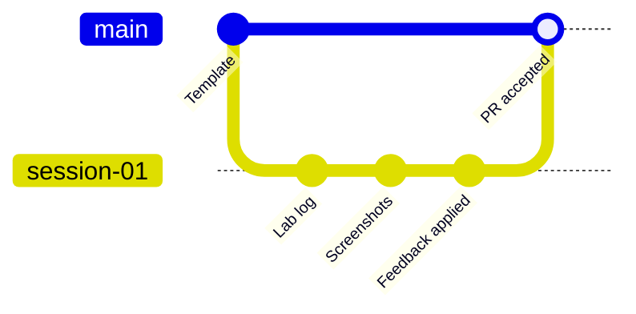

+++
title = "Markdown, Git and pull request workflow"
weight = 10
+++

## Goal

This technique is needed from the first homework on. You will learn to

- write documentation in **Markdown**,
- version it with **Git**,
- submit it through a **pull request (PR)** and work in feedback,
- name folders and screenshots so that every submission can be found and read.

## Basics

### Why Markdown?

Markdown is plain text with simple markup. It can be read and written in any editor, it compares well in Git (changes are visible line by line) and it is rendered directly by GitHub, GitLab and many wikis. A Word document, on the other hand, is a binary file to Git: you cannot see *what* has changed.

| Purpose | Markdown | Result |
|---|---|---|
| Heading | `## Title` | Heading level 2 |
| Emphasis | `**bold**`, `*italic*` | **bold**, *italic* |
| List | `- Item` or `1. Step` | Bullet list or numbered list |
| Code in text | `` `docker ps` `` | `docker ps` |
| Code block | Triple backticks with language (e.g. `bash`) | Formatted block |
| Link | `[Text](https://example.org)` | Link |
| Image | `` | Embedded image |
| Table | `\| A \| B \|` with separator row `\|---\|---\|` | Table |
| Task list | `- [ ] open`, `- [x] done` | Checklist |
| Diagram | Code block with language `mermaid` | Rendered diagram, see [Diagrams with Mermaid](#diagrams-with-mermaid) |

The complete overview of all Markdown elements is in the [Markdown Cheat Sheet](https://www.markdownguide.org/cheat-sheet/) of the Markdown Guide.

### Diagrams with Mermaid

**Mermaid** describes diagrams as text. You write a code block with the language `mermaid`, and the drawing is created when the page is displayed. This is ideal for documentation: the diagram lives in the same file as the text, Git shows changes line by line, and there are no image files that become outdated or get lost.

**Where is it rendered?** In GitHub (Markdown files, issues, pull requests), in this script and in the preview of Visual Studio Code (with the extension *Markdown Preview Mermaid Support*). A plain text editor only shows the source.

#### Structure

The first line sets the diagram type, followed by nodes and connections:

````markdown

````

Result:


#### The most important diagram types

| Type | Start | Use in the course |
|---|---|---|
| Flowchart | `flowchart TB` (top to bottom) or `flowchart LR` (left to right) | Network plans, architectures, decision trees |
| Sequence diagram | `sequenceDiagram` | Flows between systems (e.g. login, DHCP) |
| Git history | `gitGraph` | Explain branches and merges |

#### Flowchart: shapes and connections

| Notation | Meaning |
|---|---|
| `A[Text]` | Rectangle |
| `A(Text)` | Rounded |
| `A((Text))` | Circle (e.g. Internet) |
| `A{Question}` | Diamond (decision) |
| `A --> B` | Arrow |
| `A --- B` | Line without arrow (e.g. cable) |
| `A -->\|yes\| B` or `A ---\|Text\| B` | Labelled connection |
| `subgraph Name ... end` | Group (e.g. server room, VLAN) |

Example with a group and labelled cables:

````markdown

````


#### Sequence diagram

````markdown

````


`->>` is a solid arrow, `-->>` a dashed arrow (usually for replies).

#### Tips

- **Separate identifier and label:** `fw["fw-01<br/>Firewall"]`. The short identifier comes first, the displayed text is in brackets. `<br/>` creates a line break.
- **Put text with special characters in quotation marks:** brackets, colons, slashes, `#` or words like `end` otherwise break the syntax (`A["Network 10.10.10.0/24 (VLAN 10)"]`).
- **One statement per diagram.** From about 15 nodes it becomes unreadable. Split it instead (e.g. physical and logical separately).
- **Choose the direction:** `TB` for hierarchies (Internet at the top), `LR` for flows.
- **Use consistent names** as in the IP plan and on the devices.
- **Write text next to the diagram:** one sentence on what can be seen, and a legend. This helps readers with a screen reader, and helps in print or in editors without Mermaid support.
- **Try it out:** In the [Mermaid Live Editor](https://mermaid.live) you see immediately whether the code works. You can also export images there if a PNG is ever needed.

#### Typical Mermaid mistakes

| Mistake | Symptom | Solution |
|---|---|---|
| Special characters or brackets without quotation marks | "Syntax error in text" instead of a diagram | Put the text in `"..."` |
| The node name `end` | Diagram breaks | Use another identifier or write `End` |
| Forgot the `end` of a `subgraph` | Syntax error | Every `subgraph` needs an `end` |
| Code block without the language `mermaid` | Source text is displayed | Use ```` ```mermaid ```` |
| Diagram too large | Tiny font, unreadable | Split it |
| Only a diagram, no text | Not accessible, worthless if it fails | Add an explanatory sentence |

The full syntax is in the [Mermaid documentation](https://mermaid.js.org/intro/).

### Git in three sentences

Git stores the history of your files as a series of **commits** (snapshots with a description). A **branch** is a parallel line of work on which you prepare changes without altering the main line (`main`). A **pull request** is the request to take a branch into `main`, combined with a discussion and review.



### Terms

| Term | Meaning |
|---|---|
| Repository (repo) | Project folder with history |
| Clone | Copy of a repo on your computer |
| Commit | Saved state with a message |
| Branch | Line of work |
| Push | Send commits to the server (GitHub) |
| Pull request | Request to merge + review |
| Merge | Combine branches |
| Remote (`origin`) | The repo on the server |

## Step by step

Prerequisite: Git is installed (`git --version`), a GitHub account exists, and you have access to your private portfolio repository. The commands in this script have not yet been run in the course environment (*untested*).

### 1. One-time setup

```bash
git config --global user.name "First Last"
git config --global user.email "name@example.org"
git config --global init.defaultBranch main
```

The email address appears in every commit. Use the address registered with GitHub or GitHub's `noreply` address.

### 2. Clone the portfolio repository

```bash
git clone https://github.com/<organisation>/<your-portfolio>.git
cd <your-portfolio>
```

You get the exact URL through the invitation to the portfolio repository (_link follows in the first session_).

### 3. Create one branch per task

```bash
git switch main
git pull
git switch -c session-01
```

Branch names: `session-<nn>` for the documentation task and `homework-<nn>` for the homework. Lower case, no spaces.

### 4. Write the documentation

Create the files in the folder of the session (see [Folder structure](#folder-structure)) and write in Markdown. A live preview is offered by e.g. Visual Studio Code (`Ctrl+Shift+V`).

### 5. Commit

```bash
git status                  # what has changed?
git add 01-virtualization-containerization/
git commit -m "Lab 1: document Ubuntu VM with snapshot"
```

**Good commit messages** describe *what* and *why*, in one line of under about 70 characters, in the imperative or as a short sentence. Several small commits are better than one huge one at the end.

| Bad | Good |
|---|---|
| `Update` | `Lab 1: change VM network mode to bridged` |
| `fix` | `Add screenshot of the snapshot list` |
| `Submission final final 2` | `Homework 1: decision matrix VM vs. container` |

### 6. Push and open a pull request

```bash
git push -u origin session-01
```

Then on GitHub: **Compare & pull request**, fill in title and description following the [template](#template), add the lecturer as *reviewer*, **Create pull request**.

### 7. Work in feedback

The feedback is a comment in the PR. You make changes **in the same branch**:

```bash
# make changes, then
git add -A
git commit -m "Apply feedback: add reasoning on snapshots"
git push
```

The PR updates automatically. Briefly answer every comment ("done" or a reason why not) and mark it as *resolved*. Merging is done by the lecturers after approval.

### 8. After the merge

```bash
git switch main
git pull
git branch -d session-01
```

## Folder structure

Each session has its own folder named after the chapter. Images go into an `assets/` subfolder of the same session.

```text
portfolio/
├── README.md                              # Overview, name, table of contents
├── 01-virtualization-containerization/
│   ├── README.md                          # Documentation task
│   ├── homework.md                        # Homework
│   └── assets/
│       ├── 01-vm-settings.png
│       └── 02-snapshot-list.png
├── 02-networking-1/
│   └── ...
└── ...
```

Rules:

- File names in **lower case**, with hyphens, **without** spaces, umlauts or special characters.
- One entry file `README.md` per folder. GitHub displays it automatically.
- Use relative links (`assets/image.png`), no absolute paths from your own computer.

## Screenshot conventions

- **File name:** `<running-number>-<content>.png`, e.g. `03-docker-ps-output.png`.
- **Format:** PNG for user interfaces, no larger than necessary (width at most about 1600 px). No phone photos of screens.
- **Cropping:** Only the relevant section, but so that the context is recognisable (window title, command and output).
- **Caption and alt text:** Every image gets an alt text (``) and a sentence in the text on what can be seen.
- **Confidentiality:** Before saving, check whether **passwords, tokens, public IP addresses, email addresses, real student or teacher names** are visible. Black them out or take the screenshot again. The repository is private, but data does not belong in it if it is not needed.
- **Prefer text:** Submit commands and output as a code block instead of a screenshot. Screenshots only for graphical interfaces.

## Template

### README of the documentation task

````markdown
# Session <n>: <Title>

- **Author:** <Name>
- **Date:** <DD.MM.YYYY>
- **Environment:** <Host operating system, software with versions>

## Goal

<One or two sentences: What was done and why?>

## Procedure

1. <Step with command or setting>
2. ...

## Result

<Description, screenshot or command output>

## Problems and solutions

<What went wrong, how was it solved?>

## Reflection (school context)

<What does this mean for a school? Data protection, security, effort.>

## Sources

- <Link or reference>
````

### Pull request description

````markdown
## What does this PR contain?
Documentation task session 1 (Ubuntu VM, snapshots, Docker).

## Checklist
- [ ] README.md present in the session folder
- [ ] All screenshots in `assets/`, without personal data or secrets
- [ ] Commands as code blocks
- [ ] Reflection on the school context included
- [ ] Sources stated

## Open questions
<Optional>
````

## Example

A short excerpt of a submission, as it would be rendered on GitHub:

````markdown
## Procedure

1. Created VM in VirtualBox (Ubuntu Server 24.04 LTS, 2 vCPU, 2 GB RAM, 20 GB disk).
2. Created a snapshot `00-fresh-install` after the installation.
3. Installed and tested Docker:

   ```bash
   docker run --rm hello-world
   ```

## Result

The output confirms that Docker works correctly:


````

The matching commit is e.g. `Lab 1: install Docker and test with hello-world`.

## Common mistakes

| Mistake | Consequence | Better |
|---|---|---|
| Working directly on `main` | No review possible | Always use your own branch and a PR |
| Everything in one commit at the end | History without meaning | Small, described commits |
| Committed passwords, tokens or `.env` files | The secret is in the history, even after deleting | Check beforehand, use `.gitignore`; if it happened: **change the secret immediately** and inform the lecturers |
| Committed large binary files (VM images, ISOs) | Bloated repository | Do not commit, only describe and link |
| Screenshot instead of text | Not copyable, not searchable | Code block |
| Images with absolute path `C:\Users\...` | Invisible on GitHub | Relative path in `assets/` |
| Spaces and umlauts in file names | Broken links | Lower case and hyphens |
| Feedback in a new PR instead of the same branch | History falls apart | Keep committing in the same branch |

## Use in the course

Mainly used in: [Session 1]({})

From here on, every submission is handed in following this workflow. The rubric assesses *documentation quality* among other things (see [Assessment rubric]({})).

Further reading: [GitHub Docs: Hello World](https://docs.github.com/en/get-started/start-your-journey/hello-world), [GitHub Flavored Markdown Spec](https://github.github.com/gfm/), [Pro Git (book)](https://git-scm.com/book/en/v2).
