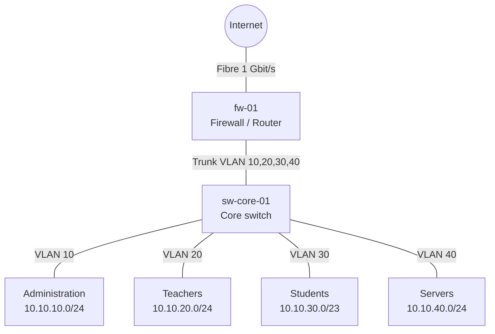

+++
title = "Network diagrams and IP plans"
weight = 20
+++

## Goal

You can present a school network so that third parties understand it: as a **diagram** (topology) and as an **IP plan** (addresses, networks, responsibilities). Together they answer: *What is connected to what, and who has which address?*

## Basics

### Diagram levels

A single diagram for everything becomes unreadable. Distinguish:

| Level | Shows | Audience |
|---|---|---|
| Physical (layer 1/2) | Rooms, cabinets, switches, cables, access points, ports | Technicians, electricians |
| Logical (layer 3) | Subnets, VLANs, routers, firewall, gateways | Administration |
| Services | Servers, services, data flows (e.g. login, Internet, cloud) | Administration, data protection |

Per diagram: **one level, one statement**.

### Components of a good diagram

- **Title, date, version, author** and a **legend** (symbols, line types, colours).
- **Labelled connections** (medium and speed, e.g. "Cat6a, 1 Gbit/s", "Trunk VLAN 10,20,30").
- **Unambiguous device names** following a fixed scheme (e.g. `sw-it-01`, `ap-fl1-03`) that also appear on the device and in the IP plan.
- Make **boundaries** visible: Internet, school network, guest network, administration network.

### Diagrams as text

Diagrams as image files from a drawing program are hard to version. With **Mermaid** (introduction: [Diagrams with Mermaid]({}#diagrams-with-mermaid)) you write the diagram as text in the Markdown file. GitHub and this script render it directly, and Git shows changes line by line. For very large or physical plans (floor plan, patch panel), drawing programs such as diagrams.net make sense. Then also save the **source file** (`.drawio`) in addition to the export (PNG/SVG).

### IP plan

An IP plan is a table of all networks and fixed addresses:

1. **Network overview:** network name, VLAN ID, network address with prefix, gateway, DHCP range, purpose.
2. **Address table:** hostname, IP, MAC (optional), location, purpose, person responsible.
3. **Conventions:** e.g. gateway always `.1`, servers `.10–.49`, printers `.50–.99`, DHCP `.100–.250`.

For private networks the ranges from RFC 1918 apply (`10.0.0.0/8`, `172.16.0.0/12`, `192.168.0.0/16`). Plan reserves: a /24 with 254 addresses is generous for a classroom, but quickly too small for a WLAN with student devices.

## Step by step

1. **Define purpose and level.** Who reads the diagram, and what should they know afterwards?
2. **Take inventory:** devices, locations, connections (walk-through, switch configuration, inventory list).
3. **Define a naming scheme and address convention** and record them in the IP plan.
4. **Plan the networks** (subnets, VLANs, reserves) and enter them in the network overview.
5. **Draw the diagram:** from the outside in (Internet → firewall → core → access). Only the important connections first.
6. **Fill in the address table**, compare it with the diagram (does every name match?).
7. **Check:** A colleague explains the network using only the documents. Open questions lead to additions.
8. **Version and update the date**, keep it up to date with every change in the network.

## Template

### Header of every document

```markdown
# Network plan <School> – <Level>
- Version: 1.0
- Date: <DD.MM.YYYY>
- Author: <Name>
- Valid for: <Location/Building>
```

### Network overview

```markdown
| Network | VLAN | Address | Gateway | DHCP range | Purpose |
|---|---|---|---|---|---|
| Administration | 10 | 10.10.10.0/24 | 10.10.10.1 | 10.10.10.100–250 | Principal, office |
| Teachers | 20 | 10.10.20.0/24 | 10.10.20.1 | 10.10.20.100–250 | Teacher devices |
| Students | 30 | 10.10.30.0/23 | 10.10.30.1 | 10.10.30.50–31.250 | Student devices |
| Servers | 40 | 10.10.40.0/24 | 10.10.40.1 | – | Internal services |
```

### Address table

```markdown
| Hostname | IP | VLAN | Location | Purpose | Responsible |
|---|---|---|---|---|---|
| fw-01 | 10.10.40.1 | 40 | Server room | Firewall | <Name> |
| srv-nc-01 | 10.10.40.10 | 40 | Server room | Nextcloud | <Name> |
```

## Example

Logical level of a small school network (Mermaid):



The network overview from the template belongs with it. The diagram shows the structure, the table the details: both refer to the same names and VLAN IDs.

## Common mistakes

| Mistake | Better |
|---|---|
| Everything in one overloaded diagram | One diagram per level |
| No legend, no labels on the connections | Add medium, speed, VLANs |
| Names in the diagram differ from device names | One naming scheme, the same everywhere |
| IP plan and reality do not match | Keep the plan up to date with every change, update the date |
| No room for growth | Plan reserves per network |
| Passwords, WLAN keys in the plan | Only a reference to the password manager |
| Only an image, no source file | Hand in the Mermaid text or `.drawio` as well |

## Use in the course

Mainly used in: [Session 2]({})
