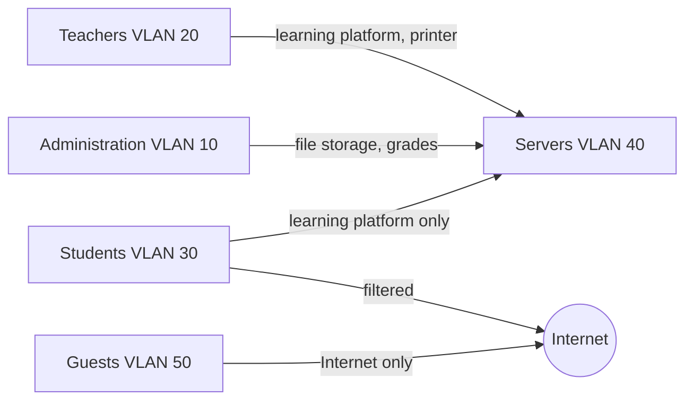

+++
title = "VLAN and permission matrices"
weight = 30
+++

## Goal

You can record **who may access what**, both at network level (which VLAN may communicate with which) and at user group level (who may use which services and data). A matrix makes rules verifiable before they are implemented in the firewall or directory service.

## Basics

### Principles

- **Need to know / least privilege:** Each group gets only the rights it needs for its task.
- **Default deny:** Whatever is not explicitly allowed is forbidden. The matrix lists permissions.
- **Roles instead of persons:** Rights are assigned to groups (e.g. *teachers*, *students of first years*, *administration*, *guests*), never to individuals.
- **Separation by protection need:** Administration data (grades, student records) needs stricter protection than a guest WLAN.

### Two matrices

**1. Network matrix (VLAN × VLAN):** rows = source, columns = destination. Entry = allowed (✔), not allowed (✘) or restricted (note on port/service).

**2. Permission matrix (group × resource):** rows = user groups, columns = resources (file storage, grade management, printer, learning platform …). Entry = access level, e.g. `R` (read), `W` (write), `A` (administer), `–` (no access).

### How they relate

The network matrix defines which connections are technically possible (firewall rules between VLANs), the permission matrix defines what a logged-in user may do within a service (group rights). Both must fit together: if students cannot reach the grade server at all according to the network matrix, a write right in the permission matrix is irrelevant, but also misleading.

## Step by step

1. **Define groups:** Who uses the school's IT? (Keep to 6–8 groups at most.)
2. **Record resources and protection need:** Which services and data exist? How sensitive (normal, high, very high)?
3. **Assign networks/VLANs:** Which group uses which VLAN? Which servers are in which VLAN?
4. **Fill in the network matrix**, starting from *everything forbidden*, allow only necessary connections.
5. **Fill in the permission matrix**, again starting minimal.
6. **Justify:** For every permission, record the purpose in a "Reason" column.
7. **Cross-check:** Play through typical scenarios ("A teacher prints from the WLAN", "A guest wants to use the projector").
8. **Implement and verify:** Create and test the rules in the firewall or directory service, then give the matrix a date and version.

## Template

### Network matrix

```markdown
| Source ↓ / Destination → | Administration (10) | Teachers (20) | Students (30) | Servers (40) | Guests (50) | Internet |
|---|---|---|---|---|---|---|
| Administration (10) | ✔ | ✘ | ✘ | ✔ (file storage, grades) | ✘ | ✔ |
| Teachers (20)       | ✘ | ✔ | ✘ | ✔ (learning platform, printer) | ✘ | ✔ |
| Students (30)       | ✘ | ✘ | ✔ | ✔ (learning platform only) | ✘ | ✔ (filtered) |
| Guests (50)         | ✘ | ✘ | ✘ | ✘ | ✔ | ✔ (filtered) |
```

### Permission matrix

```markdown
| Group | Teacher file storage | Grade management | Learning platform | Printer | Reason |
|---|---|---|---|---|---|
| Teachers | W | W (own classes only) | A (own courses) | ✔ | Teaching |
| Students | – | – | R, W (own submissions) | ✔ (quota) | Teaching |
| Administration | R | A | – | ✔ | Administration |
| Guests | – | – | – | – | No need |
```

## Example

Excerpt for a secondary school with three groups. The target picture as a diagram:



**Reading aid:** The arrow means "may initiate". The return direction (replies) is allowed automatically through connection tracking (stateful) in the firewall. There is deliberately no connection between students and administration, because grades and student records are kept in the administration.

## Common mistakes

| Mistake | Better |
|---|---|
| Rights for individuals | Roles and groups |
| "Allow everything, forbid exceptions" | Default deny, justify permissions |
| Matrix and actual firewall rules differ | Test and compare after implementation |
| No reason | Maintain the "Reason" column, it helps in review |
| Guests in the same VLAN as students | Guests get their own, isolated VLAN |
| Too fine-grained (twenty groups) | A few clear roles |
| Matrix never updated | Add version and date with every change, see [Change logs]({}) |

## Use in the course

Mainly used in: [Session 3]({})
