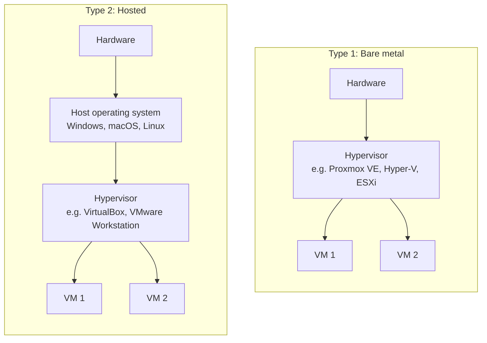
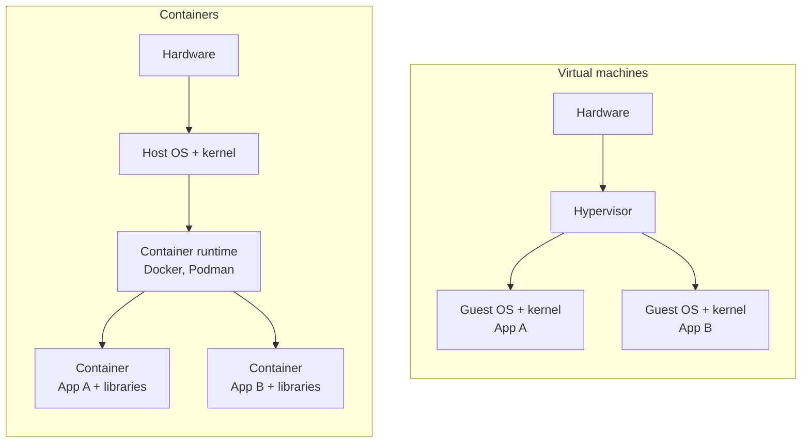
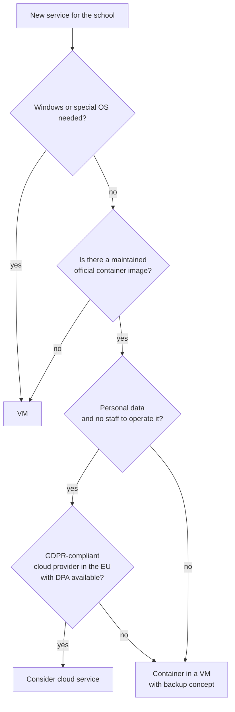

+++
title = "Theory"
weight = 20
+++

## 1. Why virtualization at school?

A typical school server is **underused** most of the time (a few percent CPU load), but must run **reliably** and needs maintenance. Virtualization solves several problems at once:

| Problem | Effect of virtualization |
|---|---|
| Several services, little hardware | several VMs on one physical host |
| Services interfere with each other (dependencies, updates) | each VM is isolated |
| Backup and recovery | VM as a file, snapshots, backup of the entire system |
| Testing updates | clone or snapshot, go back on error |
| Hardware failure | start the VM on another host |
| Energy and space | fewer devices |
| Teaching | each learner has their own, safe practice environment |

Particularly relevant for schools: **small teacher teams**, **limited budgets**, **personal data** and **changing staff**. Simple, well-documented solutions matter more than maximum technology.

## 2. Basic terms

- **Host:** the physical computer on which virtualization runs.
- **Guest:** the operating system inside the virtual machine.
- **Hypervisor (VMM):** software that provides virtual hardware and distributes resources (CPU, RAM, disk, network) among the guests.
- **Virtual machine (VM):** a complete virtual computer with its own operating system kernel.
- **Image / disk file:** the virtual hard disk as a file (e.g. `.vdi`, `.vhdx`, `.qcow2`).
- **Snapshot:** saved state of a VM to which you can return.
- **Clone:** copy of a VM, full or linked (*linked clone*).

## 3. Hypervisor types

| | Type 1 (bare metal) | Type 2 (hosted) |
|---|---|---|
| Runs on | directly on the hardware | as a program in the host operating system |
| Performance | very good | somewhat lower |
| Use | servers, data centre, school server | laptop, testing, teaching |
| Examples | Proxmox VE, Microsoft Hyper-V (Server), VMware ESXi, KVM | VirtualBox, VMware Workstation/Fusion, Parallels, UTM |
| Management | often web interface, cluster | desktop program |

**Note:** Hyper-V and KVM are often classified as type 1, although they are part of an operating system. The classification is a mental model, the boundaries are fluid.

**In the course:** On the laptop we use type 2 (VirtualBox). Later a server with Proxmox or Hyper-V can host shared scenarios.

### Hardware support

Modern CPUs have extensions for virtualization (Intel **VT-x**, AMD **AMD-V**, built into the architecture on Apple Silicon). They must be enabled in the BIOS/UEFI. Guests run **fastest when guest and host have the same CPU architecture** (x86-64 on x86-64, ARM on ARM). A different architecture must be **emulated**, which is much slower.

## 4. Virtual machines in detail

Each VM contains a **complete operating system with its own kernel**. The hypervisor provides virtual hardware: CPU cores, RAM, hard disk, network card.

### Network modes (using VirtualBox as an example)

| Mode | Behaviour | Typical use |
|---|---|---|
| **NAT** | VM reaches the Internet via the host, is not reachable from outside | Default, safe, downloading updates |
| **NAT network** | several VMs in the same private network, with Internet access | Test network with several VMs |
| **Bridged** | VM gets an address in the host's network, is visible in the LAN | Server in the real network (WLAN bridging is often problematic) |
| **Host-only** | connection only between host and VMs, no Internet | Isolated tests, management access |
| **Internal network** | only between VMs, not to the host | Closed scenario |

### Snapshots, clones, backups

- A **snapshot** freezes the state (disk, optionally RAM). It is suitable as a **short-term fallback** before changes. It is **not a backup**: it lies on the same storage as the VM, and long snapshot chains slow down and bloat the VM.
- A **clone** is an independent copy, useful for templates (*golden image*): build a clean Ubuntu VM once, then clone it as often as you like. Caution: otherwise clones have the same hostname and the same *machine ID* and must be adjusted.
- A **backup** is a copy **in a different location** that is also available if the host is lost, and it must demonstrably allow **recovery** (restore test).

## 5. Containers in detail

A container is an **isolated process (or group of processes)** that **shares the host's kernel**. Linux provides two mechanisms for this:

- **Namespaces:** each container sees only its own processes, network interfaces, file systems and users.
- **Control groups (cgroups):** limit and measure resources (CPU, RAM).

### Important terms (Docker)

| Term | Meaning |
|---|---|
| **Image** | immutable template (file system layers + start command) |
| **Container** | running (or stopped) instance of an image |
| **Registry** | storage for images (e.g. Docker Hub, GitHub Container Registry) |
| **Dockerfile** | build instructions for your own image |
| **Volume** | storage location outside the container for **persistent** data |
| **Port mapping** | link between a host port and a container port (`-p 8080:80`) |
| **Docker Compose** | describes several containers, networks and volumes in one file (`compose.yaml`) |

### Ephemeral by default

The file system of a container is **ephemeral**. If the container is deleted, the data stored in it is gone. Everything that must remain (database, uploads, configuration) belongs in **volumes** or **bind mounts**. This is the most common beginner mistake.

### Docker alternatives

Docker is widespread, but not the only runtime: **Podman** (daemonless, possible without root rights) and **containerd** are common. The concepts are the same, images are interchangeable (OCI standard).

## 6. Comparison of VM and container

| Criterion | Virtual machine | Container |
|---|---|---|
| Isolation | **strong** (own kernel, hardware abstraction) | weaker (shared kernel) |
| Size | GB (complete operating system) | MB to a few 100 MB |
| Start time | seconds to minutes | seconds or less |
| Resource needs | higher (RAM per operating system) | low |
| Guest operating systems | any (Windows, Linux, BSD …) | Linux containers need a Linux kernel (on Windows/macOS via a helper VM) |
| Portability | good (image files), but large | very good (image + Compose file) |
| Updates | operating system **and** application | replace the image, recreate the container |
| State | usually long-lived (*pets*) | usually replaceable (*cattle*) |
| Backup | whole VM or application data | volumes + Compose file |
| Typical school use | Windows Server, domain controller, legacy software | learning platform, wiki, web services, test services |

**Rule of thumb:** Container if the application is available as an image and well documented, VM if its own operating system or strong isolation is needed. In practice both are combined: *containers run inside a VM*, which adds an extra isolation layer.

## 7. Decision aid: VM, container or cloud?

Additional questions:

- **Who operates and maintains the system?** (cover, know-how)
- **How critical is the service?** (Outage in school work?)
- **What does recovery look like?** (How long may it take, how much data loss is tolerable?)
- **Which data is processed?** (protection need, see [Security and data protection]({}))
- **What does it cost?** (licences, electricity, time)

The decision is recorded as an **ADR** (see [Processing register and ADRs]({})).

## 8. Orchestration and outlook

When there are many containers, they are managed with **orchestration** (e.g. Kubernetes). At schools this is usually **oversized**. Docker Compose on a VM is enough for most services. On servers, the hypervisor (Proxmox, Hyper-V) handles the management of VMs; high availability (migrating a VM to another host) is possible with several hosts in a cluster.

## Key takeaways

- A **VM** virtualizes **hardware**, a **container** virtualizes the **operating system** (process isolation).
- **Snapshots are not backups.**
- **Container file systems are ephemeral**, data belongs in volumes.
- Whoever needs **isolation** takes a VM. Whoever needs **slimness and reproducibility** takes containers.
- **Document everything important:** versions, ports, volumes, backup, people responsible.
